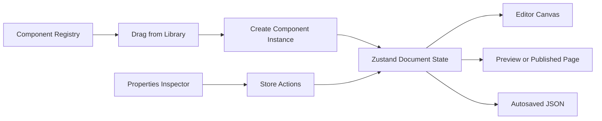

# Component Values and Data Architecture

> Status: Superseded working draft. The finalized decisions are now authoritative in `Project.md`.

## Purpose

This document explains how component definitions, placed component values, nested relationships, styles, responsive overrides, editor state, and saved page data should work in the visual website builder.

The main goal is to create a data model that is:

- Easy to edit from the properties panel
- Safe to save as JSON
- Efficient when selecting or moving deeply nested components
- Compatible with undo and redo
- Responsive across desktop, tablet, and mobile
- Extensible for future components and dynamic data
- Independent from the rendered DOM and React component instances

## Core Mental Model

The builder should treat these as separate concepts:

| Concept | Meaning | Saved in page data? |
| --- | --- | --- |
| Component definition | Application code describing how a component works | No |
| Component instance | A component that the user placed on a page | Yes |
| Project document | Pages and all component instances belonging to the project | Yes |
| Editor session state | Current selection, hover target, open panels, and active viewport | No |
| Rendered component | The React and DOM output shown on the canvas or published page | No |

The component definition is similar to a template. A component instance is the user's editable copy of that template.



## 1. Component Definitions and Registry

Every available component should have one definition in a central component registry. The registry tells the editor:

- The component's type, name, icon, and category
- How to create its initial values
- Whether it can contain children
- Which components it accepts as children
- Which controls should appear in the properties inspector
- How to render it in React
- How to migrate old instances when its schema changes

An approximate TypeScript definition could be:

```ts
type ComponentDefinition = {
  type: string;
  version: number;
  label: string;
  category: string;
  canHaveChildren: boolean;
  allowedChildren?: string[] | "any";
  defaults: {
    props: Record<string, JsonValue>;
    styles: StyleValues;
  };
  inspector: InspectorSection[];
  render: React.ComponentType<RendererProps>;
};
```

Example registry entry:

```ts
const componentRegistry = {
  card: {
    type: "card",
    version: 1,
    label: "Card",
    category: "Layout",
    canHaveChildren: true,
    allowedChildren: "any",
    defaults: {
      props: {},
      styles: {
        width: { mode: "fill" },
        height: { mode: "auto" },
        minWidth: { value: 0, unit: "px" },
        maxWidth: { value: 100, unit: "%" },
        minHeight: { value: 120, unit: "px" },
        padding: {
          top: { value: 16, unit: "px" },
          right: { value: 16, unit: "px" },
          bottom: { value: 16, unit: "px" },
          left: { value: 16, unit: "px" }
        },
        display: "block",
        backgroundColor: "#ffffff",
        borderRadius: { value: 8, unit: "px" },
        position: "static",
        zIndex: "auto"
      }
    },
    inspector: [],
    render: CardRenderer
  }
};
```

The registry contains functions and React components, so it must never be serialized into page data. Saved page data refers to a registry entry using only the component `type` and `componentVersion`.

### Default-Value Rule

When a component is dropped onto the canvas, its current defaults should be copied into the new component instance. Existing pages should not unexpectedly change just because registry defaults are changed later.

If a component definition changes in a way that requires old instances to change, that change should be handled by an explicit migration.

### Primitive Components and Composed Blocks

Basic **Container** and **Card** items are primitive components. Dropping either one creates one empty node with `childIds: []`. Heading, Text, Button, and other children must not be added automatically to every Card.

Ready-made content structures are separate block templates:

| Library item | Created result |
| --- | --- |
| Container | One empty structural container |
| Card | One empty pre-styled container |
| Content Card | Card with Heading, Text, and Button children |
| Image Card | Card with Image, Heading, and Text children |
| Pricing Card | Card with plan content, features, and Button children |

```ts
type LibraryItem =
  | {
      kind: "component";
      componentType: string;
    }
  | {
      kind: "block";
      blockType: string;
    };

type ComponentTemplate = {
  type: string;
  props?: Record<string, JsonValue>;
  styles?: Partial<ResponsiveStyles>;
  children?: ComponentTemplate[];
};

type BlockDefinition = {
  type: string;
  label: string;
  category: string;
  createTemplate: () => ComponentTemplate;
};
```

An empty Card displays an editor-only **Drop components here** or **+ Add component** prompt. The prompt is an overlay, not a component node, and is excluded from saved JSON, preview, and published output.

Block insertion recursively creates the template with fresh stable IDs, builds ordered `childIds`, updates runtime `parentById`, selects the block root, and records the entire insertion as one undoable transaction. After insertion, every generated child is a normal independent component that can be edited or moved.

## 2. Serializable Project Document

The saved document should contain JSON-compatible data only.

```ts
type JsonPrimitive = string | number | boolean | null;

type JsonValue =
  | JsonPrimitive
  | JsonValue[]
  | { [key: string]: JsonValue };
```

Do not save:

- React components
- JSX
- DOM elements
- Event objects
- Functions
- Browser references
- Zustand actions

### Project and Page Shape

```ts
type ProjectDocument = {
  schemaVersion: number;
  projectId: string;
  name: string;
  pages: Record<string, PageDocument>;
  pageOrder: string[];
  createdAt: string;
  updatedAt: string;
};

type PageDocument = {
  id: string;
  name: string;
  slug: string;
  rootIds: string[];
  nodes: Record<string, BuilderNode>;
};
```

Each page uses a normalized node collection. Components are stored by ID rather than as one deeply nested JavaScript object.

### Component Instance Shape

```ts
type BuilderNode = {
  id: string;
  type: string;
  componentVersion: number;

  childIds: string[];

  props: Record<string, JsonValue>;
  styles: ResponsiveStyles;

  meta: {
    name: string;
    locked: boolean;
    hidden: boolean;
  };

  bindings?: Record<string, DataBinding>;
};

type RuntimeTreeIndex = {
  parentById: Record<string, string | null>;
};
```

The important sections are:

- `props`: Content and behavior values specific to the component
- `styles`: Visual and layout values
- `meta`: Builder-only information that should remain with the saved component
- `bindings`: Optional future connection between a value and an external data source

`parentId` is intentionally not part of the saved node. The ordered `rootIds` and `childIds` arrays are the canonical persisted tree. Zustand builds and maintains `parentById` as a runtime reverse index for fast parent selection, breadcrumbs, nesting checks, and reparenting.

## 3. Why the Component Tree Should Be Normalized

A normalized page keeps all nodes in one `nodes` record:

```ts
const page = {
  rootIds: ["card-1"],
  nodes: {
    "card-1": {
      id: "card-1",
      type: "card",
      childIds: ["card-2"]
    },
    "card-2": {
      id: "card-2",
      type: "card",
      childIds: ["button-1"]
    },
    "button-1": {
      id: "button-1",
      type: "button",
      childIds: []
    }
  }
};
```

This structure makes it easy to:

- Select a node directly by ID
- Find its parent without walking the entire tree
- Render its children in the correct order
- Move a node between parents
- Display the Layers tree
- Build breadcrumbs
- Delete a node and all its descendants
- Compare document changes for undo and redo

Persisting both `parentId` and `childIds` would duplicate relationship truth and could allow corrupted documents where the two sides disagree. Instead, the saved document keeps only the ordered downward relationships. At runtime, Zustand derives a `parentById` reverse index once during hydration and updates that index through centralized actions. This provides fast traversal in both directions without duplicating the canonical relationship in saved JSON.

The store must enforce these invariants:

- Every child ID refers to an existing node.
- A child appears in only one parent's `childIds`.
- Every root ID exists, appears only once, and is not listed as a child.
- The runtime `parentById` index matches the canonical `rootIds` and `childIds` structure.
- A node can never become its own parent or descendant.

## 4. Categories of Component Values

### Props

Props describe component content and non-visual configuration.

Examples:

```ts
// Button props
{
  text: "Get Started",
  href: "/signup",
  openInNewTab: false
}

// Image props
{
  src: "/images/hero.jpg",
  alt: "Team working together",
  loading: "lazy"
}
```

Props should not contain editor UI state. For example, `isSelected` belongs to the editor session, not the button's props.

### Styles

Styles describe appearance and layout:

- Width and height
- Margin and padding
- Color and background
- Typography
- Borders and shadows
- Position and z-index
- Grid configuration
- Flex configuration
- Visibility at different breakpoints

For reliable editing, complex values should be structured instead of stored as uncontrolled text.

```ts
type LengthValue =
  | { value: number; unit: "px" | "%" | "rem" | "em" | "vw" | "vh" }
  | { keyword: "auto" | "fit-content" | "max-content" | "min-content" };

type DimensionValue =
  | { mode: "fill" }
  | { mode: "fit" }
  | { mode: "auto" }
  | {
      mode: "fixed";
      value: number;
      unit: "px" | "%" | "rem" | "em" | "vw" | "vh";
    };

type SpacingValue = {
  top: LengthValue;
  right: LengthValue;
  bottom: LengthValue;
  left: LengthValue;
};

type GridConfig = {
  columns: number;
  rows?: number;
  columnGap: LengthValue;
  rowGap: LengthValue;
  justifyItems?: "start" | "center" | "end" | "stretch";
  alignItems?: "start" | "center" | "end" | "stretch";
};

type FlexConfig = {
  direction: "row" | "column" | "row-reverse" | "column-reverse";
  wrap: "nowrap" | "wrap" | "wrap-reverse";
  justifyContent: string;
  alignItems: string;
  gap: LengthValue;
};

type StyleValues = {
  display?: "block" | "flex" | "grid" | "none";
  width?: DimensionValue;
  height?: DimensionValue;
  minWidth?: LengthValue;
  minHeight?: LengthValue;
  maxWidth?: LengthValue;
  maxHeight?: LengthValue;
  margin?: SpacingValue;
  padding?: SpacingValue;
  color?: string;
  backgroundColor?: string;
  borderRadius?: LengthValue;
  position?: "static" | "relative" | "absolute" | "fixed" | "sticky";
  zIndex?: "auto" | number;
  grid?: GridConfig;
  flex?: FlexConfig;
};

type StylePatch = Omit<
  Partial<StyleValues>,
  "margin" | "padding" | "grid" | "flex"
> & {
  margin?: Partial<SpacingValue>;
  padding?: Partial<SpacingValue>;
  grid?: Partial<GridConfig>;
  flex?: Partial<FlexConfig>;
};
```

Structured values allow the right panel to edit the number and unit separately, validate inputs, link spacing sides, and generate valid CSS.

### Sizing Values

Sizing should not use a component-level `auto` or `custom` flag. Width and height are independent values, and each one directly records its own behavior:

- Width `fill` compiles to `width: 100%`.
- Width `fit` compiles to `width: fit-content`.
- Height `auto` compiles to `height: auto`.
- A `fixed` dimension compiles to its numeric value and unit.

This avoids conflicts between a separate sizing mode and the actual styles. It also allows width and height, as well as each responsive viewport, to use different behaviors.

The properties inspector should provide **Fill**, **Fit**, **Auto**, **Fixed**, and **Reset sizing** controls where appropriate. Moving a component must not silently replace its dimensions. Grid and flex parents influence child sizing through normal layout properties.

### Position and Layer Values

Z-index is an ordinary style value, not a separate automatic/custom behavior:

```ts
{
  position: "static",
  zIndex: "auto"
}
```

Nesting and reparenting do not change these values. Normal document order controls ordinary stacking, and a nested child naturally renders above its parent's background. Users set a numeric z-index only for intentional overlaps, while **Reset layer** restores `z-index: auto`.

CSS z-index values are compared within stacking contexts, so `parent z-index + 1` would not reliably describe the nested component's visual layer. Editor outlines and drag feedback must use a separate overlay layer rather than modifying page-component z-index.

### Metadata

Metadata helps users manage the page but does not directly control the published component's content.

Examples:

- Readable name such as `Pricing Card`
- Locked state
- Hidden state
- Future notes or labels

The component ID must remain stable even if the user renames the component.

## 5. Responsive Values

### V1 Scope: Styles Only

Only `styles` are responsive in V1. Props such as text, `href`, image source, alt text, form labels, and component content remain shared across all viewports.

This keeps content, accessibility, SEO, localization, and analytics consistent. Responsive images should later use explicit image fields such as `srcSet`, `sizes`, or `<picture>` sources instead of making all props responsive. Alt text remains shared.

Viewport-specific content, if required later, should be implemented as a deliberate content-variant feature with its own validation and UX.

### Fixed Breakpoints

V1 uses a fixed desktop-first breakpoint profile:

```ts
type Viewport = "desktop" | "tablet" | "mobile";

const BREAKPOINTS = {
  tabletMaxWidth: 1024,
  mobileMaxWidth: 767
} as const;

type ResponsiveStyles = {
  base: StyleValues;
  tablet?: StylePatch;
  mobile?: StylePatch;
};
```

Resolution order:

| Viewport | Resolution |
| --- | --- |
| Desktop | `base` |
| Tablet | `base -> tablet` |
| Mobile | `base -> tablet -> mobile` |

Tablet compiles at `@media (max-width: 1024px)` and mobile compiles afterward at `@media (max-width: 767px)`. Mobile therefore inherits tablet overrides unless it explicitly replaces them.

Custom breakpoint IDs, user-created breakpoints, breakpoint reordering, and per-project breakpoint values are out of scope for V1. The fixed constants must live in one shared module used by both editor preview and published CSS. A future generic breakpoint model requires a `schemaVersion` migration.

### Override Semantics

- Desktop editing changes `base`.
- Tablet editing writes only a tablet patch.
- Mobile editing writes only a mobile patch.
- A missing value inherits the resolved value from the previous layer.
- Resetting a tablet or mobile value deletes that override.
- Resetting a base value restores the registry default for the node's component version.
- `undefined` is never serialized.
- `null` does not mean inherit.
- Changing a base value affects smaller viewports only when no applicable override exists.

The inspector indicates whether a displayed value is a component default, explicitly set at the current layer, or inherited. Editing an inherited value creates an override at the active layer.

### Property-Specific Merge Rules

The resolver must not use a generic recursive deep merge.

| Property category | Merge rule |
| --- | --- |
| Width, height, and min/max dimensions | Replace the complete value |
| Display, color, position, z-index, and radius | Replace the complete value |
| Margin and padding | Merge individual edges |
| Grid | Merge individual grid fields |
| Flex | Merge individual flex fields |
| Transform, shadow, gradient, and other lists | Replace the complete list |
| Discriminated unions such as `DimensionValue` | Replace the complete union value |

Dimensions are atomic because merging inside `{ mode, value, unit }` could produce an invalid value. Spacing merges per edge. Grid and flex merge only their known fields.

If resolved `display` is `grid`, the renderer applies only the grid configuration. If it is `flex`, it applies only the flex configuration. Inactive grid or flex values may remain saved so switching layout modes does not erase earlier settings.

Style resolution is conceptually:

```ts
function resolveResponsiveStyles(
  styles: ResponsiveStyles,
  viewport: Viewport
): StyleValues {
  let resolved = cloneStyles(styles.base);

  if (viewport === "tablet" || viewport === "mobile") {
    resolved = mergeStylePatch(resolved, styles.tablet);
  }

  if (viewport === "mobile") {
    resolved = mergeStylePatch(resolved, styles.mobile);
  }

  return resolved;
}
```

`mergeStylePatch` is builder-specific and implements the policy table above.

Example:

```ts
styles: {
  base: {
    display: "grid",
    grid: {
      columns: 4,
      columnGap: { value: 24, unit: "px" },
      rowGap: { value: 24, unit: "px" }
    },
    padding: {
      top: { value: 16, unit: "px" },
      right: { value: 16, unit: "px" },
      bottom: { value: 16, unit: "px" },
      left: { value: 16, unit: "px" }
    }
  },
  tablet: {
    grid: { columns: 2 },
    padding: {
      right: { value: 12, unit: "px" },
      left: { value: 12, unit: "px" }
    }
  },
  mobile: {
    grid: {
      columns: 1,
      columnGap: { value: 12, unit: "px" }
    },
    padding: {
      top: { value: 8, unit: "px" },
      bottom: { value: 8, unit: "px" }
    }
  }
}
```

The resolved mobile grid has one column, a `12px` column gap, and the inherited `24px` row gap. Its padding is `8px 12px 8px 12px`.

## 6. Zustand Store Responsibilities

Zustand should manage both document state and temporary editor state, but they should be separated into logical slices.

```ts
type BuilderStore = {
  // Saved document state
  document: ProjectDocument;

  // Derived runtime tree index; never persisted
  parentById: Record<string, string | null>;

  // Temporary editor session state
  selectedNodeId: string | null;
  hoveredNodeId: string | null;
  activeDropTargetId: string | null;
  activeViewport: "desktop" | "tablet" | "mobile";
  isDragging: boolean;

  // Document actions
  addNode: (input: AddNodeInput) => void;
  insertBlock: (input: InsertBlockInput) => void;
  moveNode: (input: MoveNodeInput) => void;
  updateProp: (nodeId: string, path: string, value: JsonValue) => void;
  updateStyle: (nodeId: string, viewport: Viewport, path: string, value: JsonValue) => void;
  resetStyle: (nodeId: string, viewport: Viewport, path: string) => void;
  duplicateNode: (nodeId: string) => void;
  removeNode: (nodeId: string) => void;

  // Session actions
  selectNode: (nodeId: string | null) => void;
  setHoveredNode: (nodeId: string | null) => void;
  setViewport: (viewport: Viewport) => void;

  // History actions
  undo: () => void;
  redo: () => void;
};
```

Important rules:

- Components must never mutate the document directly.
- Every document change goes through a named action.
- Store actions are responsible for keeping `rootIds`, `childIds`, and the runtime `parentById` index synchronized.
- `parentById` is rebuilt from the canonical saved tree whenever a document is loaded or recovered.
- Temporary selection and hover changes should not enter undo history.
- React components should subscribe only to the smallest state they need to avoid rerendering the entire canvas.
- Zustand is the in-browser editor state manager, not the permanent database.

Do not store a second copy of the selected node. Store only `selectedNodeId` and derive the selected node from `document.pages[pageId].nodes[selectedNodeId]`.

## 7. Adding a Component or Block from the Library

A primitive library item represents one component type, not a saved node:

```ts
{
  source: "library",
  item: {
    kind: "component",
    componentType: "card"
  }
}
```

A block item represents a subtree template:

```ts
{
  source: "library",
  item: {
    kind: "block",
    blockType: "content-card"
  }
}
```

When the user drops a primitive:

1. Read the active drop target and insertion index.
2. Validate that the target accepts the component type.
3. Generate a unique node ID.
4. Copy props and style defaults from the registry.
5. Add the new ID to the target's `childIds`, or to `rootIds` for a root drop.
6. Update the runtime `parentById` entry.
7. Keep the component's default Fill/Auto sizing values.
8. Keep the component's default `position: static` and `zIndex: auto` layer values.
9. Add the node through one Zustand action.
10. Select the newly created node.
11. Record the document change as one undoable transaction.

The operation should either complete fully or make no document change. It must not leave a partially inserted node.

When the user drops a block, `insertBlock` should:

1. Read and validate the complete block template.
2. Confirm the destination accepts the block's root type and every internal parent-child relationship is allowed.
3. Generate a fresh ID for every template node.
4. Copy registry defaults and apply template overrides.
5. Build the complete ordered subtree.
6. Insert its root at the requested destination and index.
7. Update `parentById` for all generated nodes.
8. Select the generated root node.
9. Commit everything as one undoable transaction.

A failed validation must insert none of the block's nodes.

## 8. Moving and Reordering Existing Components

An existing canvas component uses a different drag payload:

```ts
{
  source: "canvas",
  nodeId: "card-2"
}
```

A drop target should describe the destination clearly:

```ts
{
  parentId: "card-1",
  index: 0,
  zone: "inside"
}
```

Before moving a component, the store should verify:

- The source node exists.
- The destination exists or represents the page root.
- The destination accepts the source component type.
- The destination is not locked.
- The destination is not the source node.
- The destination is not a descendant of the source node.

The `moveNode` action should:

1. Remove the node ID from its previous parent or `rootIds`.
2. Insert it into the destination parent's `childIds` or `rootIds`.
3. Update its runtime `parentById` entry.
4. Preserve width, height, position, z-index, and other styles exactly as configured.
5. Save the entire move as one undoable transaction.

## 9. Properties Inspector Data Flow

The properties inspector should be generated from three sources:

1. Common fields available to most components
2. Fields declared by the selected component's registry definition
3. Conditional layout fields based on current values

Examples of conditional fields:

- Show grid controls only when `display` is `grid`.
- Show flex controls only when `display` is `flex`.
- Show image controls only for an image component.
- Show link controls only for components that support navigation.
- Show child placement fields when the selected node belongs to a grid or flex parent.

An inspector field definition might look like:

```ts
type InspectorField = {
  label: string;
  path: string;
  target: "props" | "styles" | "meta";
  control: "text" | "number" | "select" | "color" | "spacing" | "length";
  options?: Array<{ label: string; value: string }>;
  visibleWhen?: (node: BuilderNode, parent?: BuilderNode) => boolean;
};
```

When the user changes a field:

1. The inspector identifies the selected node and value path.
2. It validates and normalizes the entered value.
3. It calls the correct Zustand action.
4. Zustand updates the document.
5. The selected canvas component rerenders.
6. Undo history records the change.
7. Autosave schedules a document save.

Text typing, slider movement, and color dragging can generate many small updates. These changes should be grouped into one history transaction so one press of Undo reverses the complete user interaction.

## 10. Rendering Components

The saved node data should be converted into React output through the component registry.

Conceptually:

```ts
function RenderNode({ nodeId, mode }: RenderNodeProps) {
  const node = useBuilderNode(nodeId);
  const definition = componentRegistry[node.type];
  const resolvedStyles = resolveStyles(node, activeViewport);
  const cssStyle = compileStyleValues(resolvedStyles);

  return (
    <definition.render
      node={node}
      props={node.props}
      style={cssStyle}
      mode={mode}
    >
      {node.childIds.map((childId) => (
        <RenderNode key={childId} nodeId={childId} mode={mode} />
      ))}
    </definition.render>
  );
}
```

There should be three render modes:

- `editor`: Shows selection outlines, drop zones, drag handles, and labels
- `preview`: Shows the page without editor controls
- `published`: Renders the saved page for end users

Editor controls should be wrappers or overlays around the actual component renderer. They must not become part of the published markup or saved component props.

### Tailwind CSS Boundary

Tailwind CSS should style the editor shell, panels, buttons, and known component presets.

User-entered arbitrary values should be compiled into controlled inline styles, CSS variables, or generated CSS. Avoid building unpredictable runtime Tailwind classes such as:

```ts
// Avoid for arbitrary user values
const className = `w-[${userWidth}px]`;
```

The saved document should store semantic values, not framework-specific class strings. This keeps the document portable and easier to migrate.

## 11. Nested Card Rules in the Data Model

Suppose `card-2` is dropped inside `card-1`.

The relationship becomes:

```ts
nodes["card-1"].childIds = ["card-2"];
parentById["card-2"] = "card-1"; // Runtime only
```

Cards use fluid width and content-based height by default in both root and nested contexts:

```ts
nodes["card-2"].styles.base.width = { mode: "fill" };
nodes["card-2"].styles.base.height = { mode: "auto" };
nodes["card-2"].styles.base.maxWidth = { value: 100, unit: "%" };
nodes["card-2"].styles.base.minWidth = { value: 0, unit: "px" };
```

The parent's padding naturally makes the nested card appear smaller. Reparenting does not rewrite these dimensions or overwrite a fixed value chosen by the user. A **Reset sizing** command restores the component's Fill/Auto defaults.

Nesting does not modify layer values:

```ts
nodes["card-2"].styles.base.position = "static";
nodes["card-2"].styles.base.zIndex = "auto";
```

Reparenting preserves any explicit position or numeric z-index chosen by the user. The editor never calculates z-index from the parent.

## 12. Selection Data

Selection should use stable node IDs:

```ts
selectedNodeId: "card-2"
```

All selection interfaces should read and update the same value:

- Canvas outline
- Layers tree
- Breadcrumb
- Properties inspector
- Keyboard parent selection
- Overlapping-layer picker

Breadcrumbs should be derived by following the runtime `parentById` index:

```text
Canvas > Card 1 > Card 2 > Button 1
```

The Layers tree should be derived from `rootIds` and each node's `childIds`. Do not save separate breadcrumb or Layers structures because they would duplicate the component tree and could become inconsistent.

## 13. Undo and Redo

Undo history should record document changes, not temporary UI changes.

Undoable operations include:

- Add component
- Move or reorder component
- Update props
- Update styles
- Duplicate component
- Delete component
- Change responsive override
- Rename, hide, or lock component

Not undoable:

- Hovering
- Selecting
- Opening a panel
- Changing canvas zoom
- Switching the preview viewport

For an initial version, document snapshots may be simple and reliable. If pages become large, history can move to patches or command objects to reduce memory usage.

Continuous changes should be grouped:

- One typing session becomes one history entry.
- One slider drag becomes one history entry.
- One drag-and-drop move becomes one history entry.
- Changing four linked padding values can become one history entry.

## 14. Autosave and Persistence

Zustand holds the active browser state. Permanent project data should be saved through a Next.js server API to a database or storage layer.

Recommended save flow:

1. A document action marks the document as dirty.
2. A short debounce avoids saving after every keystroke.
3. The project document is validated and serialized.
4. The client sends the document and current revision to the server.
5. The server validates it again before saving.
6. The server returns the new revision and save timestamp.
7. The editor shows `Saving`, `Saved`, or `Save failed`.

The saved document should include a revision number to prevent two browser tabs from silently overwriting each other's changes.

Local recovery storage can preserve unsaved work after a refresh or crash, but it should not replace server persistence.

## 15. Schema Versioning and Migrations

Two types of versioning are useful:

- `schemaVersion` for the complete project-document format
- `componentVersion` for individual component types

Example:

```ts
{
  schemaVersion: 2,
  nodes: {
    "button-1": {
      type: "button",
      componentVersion: 3
    }
  }
}
```

When loading a document:

1. Validate the basic JSON structure.
2. Run project migrations until the document reaches the current schema version.
3. Run component migrations where needed.
4. Validate the final result.
5. Load it into Zustand only after successful migration.

Unknown component types should render a safe placeholder in the editor rather than crashing the entire page.

## 16. Future Dynamic Data Binding

The first version should use static component values. The schema can reserve an optional `bindings` map for future data sources without making every current value complicated.

```ts
type DataBinding = {
  sourceId: string;
  path: string;
  fallback?: JsonValue;
};

const bindings = {
  "props.text": {
    sourceId: "currentProduct",
    path: "name",
    fallback: "Product name"
  }
};
```

At render time, a valid binding can override the static fallback stored in `props`. The properties inspector can show whether a field is static or bound.

Dynamic binding should not allow arbitrary JavaScript or `eval`. It should use controlled paths, approved transforms, and validated data sources.

## 17. Validation and Security

Both the browser and server should validate saved project documents.

Validation should cover:

- Required IDs and component types
- Unique node IDs
- Valid parent and child relationships
- No recursive component cycles
- Allowed component nesting
- Valid style units and ranges
- Valid URLs and link protocols
- Maximum nesting depth
- Maximum node count and document size
- Component-specific prop schemas

Rich text or custom HTML must be sanitized. The first version should not allow users to save or execute arbitrary scripts, event-handler strings, or unsafe URLs.

A runtime schema-validation library such as Zod can be considered when implementation begins.

## 18. Recommended Initial Decisions

For the first working version:

1. Use a normalized `nodes` record with canonical ordered `rootIds` and `childIds`.
2. Do not persist `parentId`; derive and maintain `parentById` in runtime Zustand state.
3. Store only JSON-compatible document data.
4. Keep component definitions in a code-based registry.
5. Copy registry defaults when creating each component instance.
6. Represent width and height independently with Fill, Fit/Auto, or Fixed values; do not add a global sizing mode.
7. Use fixed base, tablet, and mobile style layers with the desktop-first `base -> tablet -> mobile` cascade.
8. Keep props shared across viewports; make only styles responsive in V1.
9. Merge responsive values with explicit atomic, edge, grid-field, and flex-field policies.
10. Keep props, styles, metadata, and session state separate.
11. Make every document mutation a named Zustand action.
12. Start with static values and reserve a separate `bindings` map for the future.
13. Store semantic style values instead of arbitrary Tailwind class strings.
14. Add document and component schema versions from the beginning.
15. Create primitive Cards and Containers empty; provide pre-populated content through separate block templates.

## 19. Proof-of-Concept Acceptance Scenario

Before building the complete editor, the data model should pass this scenario:

1. Add a primitive Card and confirm it creates one node with `childIds: []`.
2. Confirm the empty-state prompt appears only in editor mode.
3. Add a Content Card block and confirm it creates a Card, Heading, Text, and Button subtree with fresh IDs.
4. Undo and redo the complete block insertion as one transaction.
5. Add a second Card inside the outer Card.
6. Add a Button inside the second Card.
7. Select every nesting level using the canvas, Layers tree, and breadcrumb.
8. Set four base grid columns and two tablet columns; confirm mobile inherits two columns until overridden.
9. Set horizontal tablet padding and vertical mobile padding; confirm the resolved mobile value merges both patches.
10. Change Button text once and confirm every viewport uses the same prop value.
11. Confirm responsive JSON contains only fixed `base`, `tablet`, and `mobile` style layers.
12. Move the Button back to the outer Card.
13. Confirm sizing, position, and z-index values are preserved without automatic recalculation.
14. Undo and redo the move.
15. Save the page as JSON without responsive props, custom breakpoint IDs, or editor-only placeholder nodes.
16. Reload it and confirm the same tree, values, selection targets, and responsive output are restored.

## 20. Open Questions Before Finalization

These choices should be discussed before this draft is finalized:

- Should the first version support free absolute positioning or only normal, flex, and grid layouts?
- Should complex components have named child slots, such as `header`, `body`, and `footer`?
- Should colors and spacing support global design tokens from the first version?
- What should be the maximum supported nesting depth?
- Should hidden components remain visible in an editor-only outline mode?
- Should custom CSS be supported, and if so, how should it be validated and scoped?
- When should dynamic CMS or API data binding be introduced?
