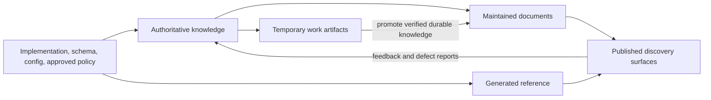

# Documentation standard

**Standard ID:** DOC-STD
**Version:** 1.0.0-draft
**Status:** Proposed
**Intended scope:** Maintained software-engineering documentation across one or
more repositories
**Canonical owner:** Unassigned; adoption is blocked until an accountable
Documentation Governance Owner is named
**Evidence:** [`00-research-synthesis.md`](00-research-synthesis.md)

## 1. Purpose

This standard makes documentation trustworthy, findable, maintainable, and safe
for humans and AI agents. It governs how knowledge is created, owned, verified,
published, changed, superseded, archived, and deleted. It does not require a
document for every activity.

The terms **MUST**, **MUST NOT**, **SHOULD**, **SHOULD NOT**, and **MAY** use the
meanings in RFC 2119 and RFC 8174. Normative terms are used only when a control
has an enforcement or accountable review path. [E: S15]

Recommendation annotations:

- **[E]** evidence-backed practice
- **[S]** synthesis of cited practices
- **[P]** organization-specific proposal

Source IDs resolve through [`sources.md`](sources.md).

Section-level traceability:

| Section | Classification and evidence-matrix basis |
| --- | --- |
| 2–3 Operating model and invariants | S/P: canonical-source, generated-boundary, ownership, freshness, and AI-integrity rows |
| 4 Universal contract | S/P: audience/outcome, finite model, minimal documentation, ownership, AI provenance, and seven-field manifest rows |
| 5 Authority by class | P: one-authority proposal informed by S7, S10, S11, S12, S13 and local rule L1 |
| 6 Class profiles | E/S: generated reference, ADR, postmortem, content-model, and lifecycle rows |
| 7 Writing/formatting | E/P: S1–S6, S14, S17–S18; WCAG AA target is an organization-specific control |
| 8 Human and AI responsibilities | E/S/P: NIST information-integrity evidence plus review/linter practices and the AI-workflow synthesis row |
| 9 Review/quality gates | S/P: repository review and linter evidence; R0–R3 thresholds are a proposal |
| 10 Lifecycle/freshness | E/S/P: ADR/postmortem/expiry evidence plus verification-state synthesis |
| 11 Security/privacy/retention | P informed by S13–S16; actual policy values remain organizational decisions |
| 12–14 Multi-repository, exceptions, adoption | P informed by S1, S7–S10 and local workspace evidence |

## 2. Operating model

Documentation is a set of governed views over knowledge, not an independent
truth system.

Text equivalent: implementation, schemas, configuration, and approved policy
establish authoritative knowledge. Maintained documents curate that knowledge;
generators derive reference material; temporary artifacts may promote verified
durable knowledge; published views return feedback to the authority.

The complete ontology and information-flow rules are canonical in
[`02-document-taxonomy.md`](02-document-taxonomy.md).

## 3. Architecture invariants

1. **One authority.** A knowledge domain MUST have exactly one authoritative
   source for a defined scope, version, and validity period. Replicas and
   summaries are derived views. [S/P: S7, S10]
2. **Implementation wins for current behavior.** Verified code, schema,
   configuration, tests, and runtime behavior override prose that describes
   current implementation. Prose may be authoritative for approved policy,
   intent, rationale, and manual procedure. [P: L1]
3. **No silent conflict.** A contributor or agent that finds conflicting
   authorities MUST stop mutation, record the conflict, and obtain a decision
   from the accountable owner. [S: S8, S16]
4. **No duplicate authority.** A document MUST link to an existing authority
   instead of copying independently maintained facts. [E: S7]
5. **Bounded types.** Every maintained document MUST declare one primary type
   from the finite taxonomy. A new type requires a materially different
   purpose, audience, structure, owner, authority, or lifecycle. [E/S: S4, S6]
6. **Explicit derivation.** Generated or synchronized content MUST identify its
   source, generator/process, source revision, and generated status. [S: S8,
   S11]
7. **Owner before publication.** Every maintained document MUST have one
   accountable owner role or team. “Everyone,” an AI agent, and an inactive
   individual are invalid owners. [E/S: S10, S12]
8. **Freshness is evidence.** A recent edit is not proof of correctness.
   Freshness is `verified`, `suspect`, `invalidated`, or `unknown`, based on
   dependency and review evidence. [S: S8–S9]
9. **Lifecycle matches type.** Living guidance updates in place; accepted
   decision and incident records are superseded, not rewritten; generated
   reference is regenerated; temporary artifacts are promoted or archived.
   [E/S: S9, S12–S13]
10. **AI is not an authority.** AI MAY draft or analyze, but it MUST NOT invent
    facts, owners, citations, approvals, evidence, dates, or test results, and
    MUST NOT approve judgment-heavy or high-risk changes. [E/S: S16]

## 4. Universal maintained-document contract

### 4.1 Creation test

A new maintained document MAY be created only when all answers are available:

| Question | Required result |
| --- | --- |
| What reader or control outcome does it serve? | A specific task, decision, learning need, evidence obligation, or operational outcome. |
| Is an authority already present? | If yes, update or link unless a derived view is justified. |
| Why is a separate document needed? | Distinct purpose, audience, owner, authority, or lifecycle. |
| Who owns it? | One accountable role/team. |
| What invalidates it? | Named code, schema, policy, product, incident, or time-based trigger. |
| How is it verified? | Machine, hybrid, or accountable human check. |
| How does it end? | Maintain, supersede, archive, or delete rule. |

If any answer is unknown, the author MUST keep the content as a temporary
artifact or request an owner decision; it MUST NOT be published as maintained
knowledge. [S/P: S3–S4, S16]

### 4.2 Manifest

Every maintained document MUST expose the following fields in front matter, a
sidecar catalog, or a repository-derived manifest. Repeating fields in every
file is not required when tooling can derive them reliably. [P]

| Field | Meaning |
| --- | --- |
| `doc_id` | Stable, unique identifier independent of title/path. |
| `type` | Taxonomy type ID. |
| `scope` | Organization, product, repository, component, audience, and version boundary as applicable. |
| `authority` | What knowledge this document owns, or the canonical authority it derives from. |
| `owner` | One accountable team/role, mapped to a real identity at adoption. |
| `lifecycle` | `draft`, `in_review`, `approved`, `maintained`, `superseded`, `archived`, or `retired`. |
| `freshness` | State plus verification evidence or invalidation trigger. |

Profile-specific metadata MUST be added only when it changes governance,
rendering, validation, retention, or discovery behavior.

### 4.3 Evidence and uncertainty

- Claims about current system behavior MUST link to verifiable code, schema,
  configuration, tests, runtime evidence, or generated reference. [P: L1]
- External practice claims MUST cite a direct primary source. Secondary sources
  MAY be used only when no primary source exists and MUST be labeled. [P]
- Facts, inferences, proposals, hypotheses, and decisions MUST be
  distinguishable. [S: S16]
- Unknown or conflicting evidence MUST be stated with the action needed to
  resolve it. An agent MUST NOT silently choose the most convenient answer.
- Screenshots, logs, and examples MUST NOT be treated as current authority when
  a deterministic source exists.

### 4.4 Links and reuse

- Link text MUST identify the destination or outcome; generic text such as
  “click here” is prohibited. [E: S14, S17]
- Stable, independently meaningful content SHOULD be linked, not transcluded.
- Reuse MAY be used for short, stable, identically scoped facts. Reusable
  fragments MUST have an owner, version rules, and reverse-dependency tracking.
- A copied fact that can drift independently is a defect.
- Cross-repository links MUST use a stable repository-relative identifier,
  catalog ID, or versioned URL; local machine paths MUST NOT be published.

## 5. Authority by knowledge class

| Knowledge | Default authority | Documentation role |
| --- | --- | --- |
| Current implemented behavior | Code, schema, configuration, tests, verified runtime | Explain, navigate, and record verification; never override behavior silently. |
| Public API/CLI/config fields | Contract schema or executable definition | Generate reference; maintain task-oriented examples separately. |
| Organization policy | Approved policy record | Provide governed normative rules and implementation guidance. |
| Architecture rationale | Accepted ADR | Explain the chosen decision; supersede with a later ADR. |
| Product/feature intent before delivery | Approved feature specification | Define desired outcomes; after delivery, as-built behavior is authoritative. |
| Work progress | Issue/tracker/journal selected by the team | Report status; do not promote unverified state into durable architecture. |
| Manual operational action | Approved runbook | Provide safe, tested procedure linked to automation/config authorities. |
| Incident facts and learning | Final reviewed postmortem and linked incident evidence | Preserve the record; track actions in the work system. |
| Release contents | Release pipeline, change metadata, and approved release record | Publish a curated, audience-specific change view. |
| Validation outcome | Test/audit/review evidence | State scope and time; never imply broader coverage. |

An organization MAY select different authorities, but each exception MUST be
recorded in the Knowledge Domain Register and pass the no-duplicate-authority
check in [`02-document-taxonomy.md`](02-document-taxonomy.md).

## 6. Document-class profiles

The taxonomy owns type definitions. These profiles own cross-type behavior.

### 6.1 Maintained guidance

Applies to architecture descriptions, developer guides, how-to guides,
troubleshooting, knowledge-base articles, data-model explanations, test
strategies, and runbooks.

- Update in place when the authority changes.
- Define dependency-based invalidation triggers.
- Verify commands and procedures in a representative environment before
  approval; record limitations.
- High-risk runbooks MUST include preconditions, safety checks, rollback,
  escalation, observability, and a last successful exercise.

### 6.2 Immutable records

Applies to accepted ADRs, final postmortems, formal reviews, and approved audit
records.

- After acceptance, meaning-changing edits are prohibited.
- Correct typographical errors through auditable errata that do not alter the
  recorded decision or incident facts.
- Changed conclusions require a new record linked with `supersedes` or
  `amends`. [E: S12–S13]

### 6.3 Delivery and execution artifacts

Applies to feature specifications, research, investigations, plans, trackers,
and implementation reports.

- Before approval, these MAY evolve in place.
- Status documents MUST have one execution-state authority; duplicate trackers
  are prohibited.
- At completion, verified durable knowledge MUST be promoted to its canonical
  domain; the remaining artifact becomes a retained record or is archived.
- Research hypotheses MUST NOT be promoted as facts without verification.

### 6.4 Generated reference

Applies to API, CLI, configuration, event, and schema reference.

- Human edits to generated output are prohibited.
- Fix the authority annotations or generator and regenerate.
- The output MUST identify source revision, generator version, generation
  status, and supported product version.
- Generation and drift checks MUST run with the owning contract’s change
  pipeline before publication. [E/S: S11]

### 6.5 Published views

Navigation, search indexes, portals, dashboards, and summaries are discovery
surfaces, not independent authorities.

- They MUST link to canonical instances and expose scope/version.
- Search results SHOULD prefer authoritative, maintained, version-compatible
  content over superseded or archived items.
- Archived content MUST be visibly labeled and excluded from default active
  discovery unless a reader requests history.

## 7. Writing and formatting rules

### 7.1 Reader and structure

- Start with the outcome or decision a reader needs. [E: S2–S5]
- Use one primary audience and purpose per document; split only when audience,
  authority, or lifecycle materially differs.
- Use descriptive, properly nested headings and provide a text equivalent for
  diagrams. [E: S14, S17]
- Use numbered lists for ordered procedures and bullets for unordered sets.
- Put prerequisites and hazards before the action they constrain.
- Keep reference factual and scannable; keep how-to steps minimal; keep
  explanation focused on why; keep tutorials safe and learning-oriented.
  [E: S5–S6, S18]

### 7.2 Language

- Use active voice, present tense, direct language, and sentence-case headings.
  [E: S2, S17]
- Address the reader as “you” when useful. Avoid “easy,” “simple,” “just,”
  idioms, hype, and promises about unspecified future behavior.
- Use one term for one concept. Product terms and UI labels MUST match their
  authorities exactly.
- Date-sensitive statements MUST use explicit versions or dates, not
  “currently,” “new,” or “soon.”

### 7.3 Code, commands, examples, and diagrams

- Code fences MUST declare a language where one exists.
- Examples MUST state whether they are executable, illustrative, partial, or
  pseudocode.
- Never include live secrets, tokens, personal data, production identifiers, or
  unredacted sensitive logs.
- Commands with destructive or irreversible effects MUST include scope,
  confirmation, backup/rollback, and expected output.
- Generated examples SHOULD be sourced from tested files when feasible.
- Diagrams MUST state scope and provide a textual equivalent. A diagram that
  duplicates a source model without a regeneration path is maintained content
  with its own invalidation obligation.

### 7.4 Accessibility and localization

- Published documentation MUST target WCAG 2.2 AA for applicable content and
  interactions. [P, informed by S14]
- Images require meaningful alternatives; decorative images use empty
  alternatives.
- Color, position, or shape MUST NOT be the only carrier of meaning.
- Tables require headers and MUST NOT be used for page layout.
- Procedures and sentences SHOULD avoid constructs that create unnecessary
  translation ambiguity. [E: S2, S8]

## 8. Human and AI responsibilities

### 8.1 AI-permitted work

AI MAY:

- classify a request against the taxonomy;
- retrieve and compare candidate authorities;
- draft from supplied evidence;
- detect broken links, duplicate passages, missing manifest fields, and
  structural issues;
- propose citations, tests, owners, and lifecycle transitions for human
  confirmation;
- generate deterministic reference through approved tooling.

### 8.2 AI-prohibited autonomous work

AI MUST NOT independently:

- assert unverified project facts or fabricate citations;
- assign a real owner, approval, retention class, or legal conclusion;
- resolve conflicting authorities;
- change an accepted record’s meaning;
- delete or retire knowledge;
- publish high-risk operational, security, privacy, legal, financial, or safety
  instructions;
- claim tests, reviews, runtime behavior, or stakeholder decisions occurred
  without evidence.

### 8.3 Required AI workflow

Before proposing a factual change, an AI agent MUST:

1. Load applicable repository and workspace instructions.
2. Identify the knowledge domain, scope, version, current authority, owner, and
   document type.
3. Retrieve the minimum evidence needed and record unavailable evidence.
4. Classify each material statement as verified fact, inference, proposal,
   hypothesis, or external practice.
5. Apply the mutation decision in
   [`04-governance-and-decision-framework.md`](04-governance-and-decision-framework.md).
6. Run machine checks and request required human verification.
7. Stop on conflicts, missing authority for high-risk content, tool failure that
   prevents verification, or version ambiguity.

Adversarial scenarios and recovery controls are canonical in
[`10-ai-failure-analysis.md`](10-ai-failure-analysis.md).

## 9. Review and quality gates

| Risk tier | Examples | Minimum gate |
| --- | --- | --- |
| R0 — editorial | Typo or wording with no meaning change | Machine checks; author self-review. |
| R1 — normal | Guide, concept, low-risk feature documentation | Technical verifier plus machine and rendered checks. |
| R2 — high | API compatibility, migrations, security behavior, production runbooks, incident conclusions | Accountable domain owner and relevant specialist; tested procedure/evidence; rollback or containment. |
| R3 — regulated/critical | Legal, privacy, financial-control, safety, destructive operations | Named accountable authority, specialist approval, retained evidence, separation of duties, and policy-defined retention. |

Every change MUST pass:

1. authority and duplicate check;
2. scope/version check;
3. evidence and technical-accuracy check;
4. link, manifest, Markdown, and accessibility-structure checks;
5. rendered-output check when published;
6. type-specific checks;
7. owner approval required by its risk tier.

Machine, hybrid, and human rules are canonical in
[`08-documentation-linter-rules.md`](08-documentation-linter-rules.md).

## 10. Lifecycle and freshness

### 10.1 States

`draft → in_review → approved/maintained → superseded → archived → retired`

Generated reference uses `generated → invalidated → regenerated`. Temporary
artifacts use `active → promoted-and-archived` or `active → archived`.

### 10.2 Invalidation

A maintained document becomes `suspect` when a declared dependency changes and
`invalidated` when a control proves the document is incompatible or false.
Unknown dependency state yields `unknown`, not `verified`.

High-risk maintained documents MUST also have a maximum verification interval
selected by policy. Lower-risk documents SHOULD use change-triggered review to
avoid ceremonial timestamp edits.

### 10.3 Archive and deletion

- Superseded or completed records SHOULD be archived with redirects and
  relationship links when historical value remains.
- Archived content is read-only and excluded from active defaults.
- Deletion requires: confirmed canonical replacement or expired retention,
  reverse-link/dependency check, owner approval, legal/security check where
  applicable, recoverable backup or recorded rationale, and redirect/tombstone
  decision.
- An AI agent MUST NOT authorize deletion.

## 11. Security, privacy, legal, and retention

- Classify sensitive material before storage or publication.
- Store sanitized evidence by default. Raw secrets, credentials, personal data,
  production logs, and customer identifiers MUST NOT enter ordinary docs.
- Access controls MUST follow the content classification; public discovery
  surfaces MUST NOT index restricted content.
- Retention periods MUST come from an approved retention schedule. This
  standard intentionally does not invent durations.
- Legal hold, incident forensics, and regulated evidence override ordinary
  archival/deletion rules.
- External links, examples, dependencies, and AI inputs MUST be reviewed for
  data disclosure and supply-chain risk at the applicable tier.

## 12. Multi-repository model

Each repository MUST keep documentation next to the authority when local
ownership and change coupling dominate. Cross-repository knowledge MUST live in
one designated authority repository or governance catalog and link outward.

Minimum organization catalog:

- Knowledge Domain Register
- Document Type Registry
- owner-to-real-team mapping
- repository and version discovery index
- standard/tool compatibility matrix
- exception and waiver register

Repository-local rules MAY be stricter and take precedence within their scope.
They MUST NOT weaken organization-level safety, security, privacy, retention, or
authority invariants without an approved exception. [E/P: S1]

## 13. Exceptions

An exception MUST include:

- rule ID and exact scope;
- reason and risk;
- accountable owner and approver;
- compensating controls;
- issue/reference;
- start and expiry dates;
- validation and exit criteria.

Exceptions are never implied by legacy content. Expired exceptions fail closed
for blocking safety and authority rules. Autofix MUST NOT create exceptions.

## 14. Adoption condition

This draft is suitable for a bounded pilot only. Organization-wide enforcement
is blocked until:

1. a Documentation Governance Owner is named;
2. knowledge domains and real owners are registered;
3. retention, classification, and supported-version policies are supplied;
4. R2/R3 approval roles are mapped;
5. the linter’s blocking rules pass precision testing;
6. a repository pilot meets the exit criteria in
   [`03-adoption-plan.md`](03-adoption-plan.md).

## 15. Decision summary

**Recommended model:** one authority per knowledge domain, bounded types,
type-specific lifecycle, generated reference from deterministic sources, and
risk-tiered human/automation controls.

**Most important mandatory rules:** identify authority and owner before
publication; never duplicate an authority; verify current behavior against
implementation; never let AI invent or approve; treat accepted records as
immutable; invalidate on dependency change; require safe deletion and high-risk
review.

**Key trade-offs:** metadata and governance add cost; risk tiers and derived
metadata keep that cost proportional. Generated reference reduces drift but
depends on trustworthy schemas and pipelines. Immutable records preserve
history but require superseding documents.

**Major weaknesses and mitigations:** real owners, retention rules, analytics,
and version support are unavailable. The proposal labels those gaps, blocks
broad rollout, and uses a measured pilot.

**Accepted improvements:** explicit authority cardinality, freshness states,
AI stop conditions, standard compatibility, waiver expiry, recovery rules, and
risk-tiered enforcement.

**Deferred improvements:** automated semantic drift detection, enterprise search
ranking, and guarded remediation until prerequisite data and precision exist.

**Rejected improvements:** mandatory document bundles for all changes, manual
duplication of generated reference, edit-date freshness, AI approval, and
unbounded metadata.

**Compatibility impact:** repositories may keep stricter local templates, but
must map them to the taxonomy and preserve stable IDs/paths or supply migration
and redirects.

**Open organizational decisions:** governance owner, owner map, risk thresholds,
retention schedule, supported versions, publication platform, search analytics,
and regulated-content scope.
