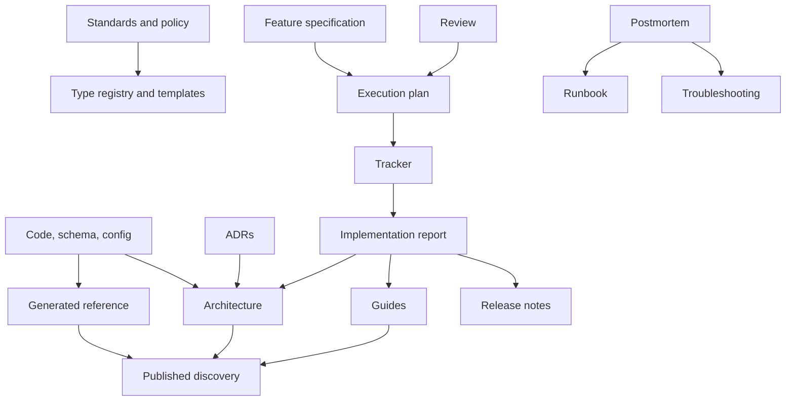

# Document taxonomy and knowledge architecture

## 1. Canonical definitions

| Entity | Definition |
| --- | --- |
| **Knowledge domain** | A bounded subject whose facts, intent, decisions, procedures, or records require one authority for a scope, version, and period. |
| **Authority** | The source allowed to settle a claim within that boundary. |
| **Family** | A governance grouping whose members share broad purpose and control needs. |
| **Type** | A finite class with distinct purpose, primary audience, owner, authority role, structure, and lifecycle. |
| **Variant** | A constrained specialization of a type that does not change its authority or lifecycle. |
| **Template** | Reusable structure for one or more types/variants; never an authority itself. |
| **Instance** | A concrete document with a stable `doc_id`, one primary type, one accountable owner, and one lifecycle. |
| **Generated reference** | A reproducible view derived from code, schema, or configuration. |
| **Discovery surface** | Index, portal, search result, dashboard, or navigation view that points to instances. |
| **Temporary artifact** | Work-in-progress evidence or coordination content that has not been promoted to durable knowledge. |

## 2. Layer model

| Layer | Contents | Authority behavior |
| --- | --- | --- |
| L0 — Executable truth | Code, schemas, configuration, tests, verified runtime | Default authority for current implemented behavior and machine contracts. |
| L1 — Organization governance | Approved standards, policies, retention, classification, domain register | Authority for normative organizational behavior. |
| L2 — Cross-repository durable knowledge | System architecture, cross-repo ADRs, shared guides, central catalogs | Authority only for the knowledge domains explicitly assigned to it. |
| L3 — Repository/component durable knowledge | Component architecture, local ADRs, runbooks, developer guides | Authority within declared repository/component/version scope. |
| L4 — Delivery and evidence | Specifications, research, investigations, plans, trackers, reports, reviews, postmortems | Intent, state, or historical evidence; promote verified durable conclusions upward. |
| L5 — Derived and published views | Generated reference, portals, indexes, summaries, search | Non-authoritative views that expose provenance and version. |
| L6 — Archive | Superseded/completed records and retained history | Read-only historical evidence, excluded from active defaults. |

Higher layer number does not imply lower value. Authority depends on the
knowledge domain, not the layer number.

## 3. Architecture and cardinality invariants

1. A `(knowledge_domain, scope, version, validity_period)` tuple has exactly one
   authority.
2. An instance has exactly one primary type and exactly one accountable owner.
3. A type maps to exactly one default lifecycle profile; variants MAY add gates
   but MUST NOT silently change the authority model.
4. A template serves one or more compatible types/variants and has no lifecycle
   state of its own.
5. An authority may have zero or many derived views; every derived view points
   to exactly one derivation definition and all source authorities used.
6. A maintained instance declares zero or more dependencies and one or more
   invalidation triggers.
7. An accepted record MAY supersede multiple earlier records, but a superseded
   record MUST identify all direct successors.
8. A discovery surface may index many instances but MUST NOT become a second
   owner of their content.
9. A temporary artifact either remains temporary, promotes verified knowledge,
   or archives; it MUST NOT become durable merely through age or repeated use.
10. A knowledge-domain ownership gap and a duplicate authority are both
    blocking defects.

## 4. Finite family and type registry

The registry is intentionally bounded to 22 primary types. New names that share
purpose, authority, owner, and lifecycle are variants, not new types.

### G — Governance

| ID | Type and variants | Purpose / primary audience | Authority and default owner capability | Lifecycle |
| --- | --- | --- | --- | --- |
| G1 | Standard or policy | Normative organization/repository behavior; all contributors | Approved policy is authoritative; Governance Owner | Draft → approved → versioned/superseded → archived |
| G2 | Architecture decision record (ADR) | Preserve a significant decision and rationale; builders/reviewers | Accepted ADR owns rationale; Architecture Owner | Proposed → accepted/rejected → superseded; immutable after acceptance |

### A — Architecture and contracts

| ID | Type and variants | Purpose / primary audience | Authority and default owner capability | Lifecycle |
| --- | --- | --- | --- | --- |
| A1 | Architecture description | Explain structure, boundaries, flows, constraints; engineers/operators | Current behavior derives from L0; Architecture Owner owns the curated view | Maintained in place; dependency-invalidated |
| A2 | Interface guide | Curate API/event/CLI usage and examples; integrators | Contract schema owns fields; Interface Owner owns guidance | Maintained; versioned with contract |
| A3 | Data-model guide | Explain entities, ownership, invariants, privacy; engineers/analysts | Schema/code owns current model; Data Owner owns guidance | Maintained; migration-invalidated |
| A4 | Generated reference | Enumerate API/CLI/config/event/schema surface; machines/builders | Deterministic source is authority; Tool/Contract Owner | Generate → validate → publish → invalidate/regenerate |

### D — Delivery and change

| ID | Type and variants | Purpose / primary audience | Authority and default owner capability | Lifecycle |
| --- | --- | --- | --- | --- |
| D1 | Feature specification (includes PRD/RFC intent profile) | Define problem, outcomes, constraints, acceptance; product/delivery team | Approved spec owns delivery intent until changed; Product/Domain Owner | Draft → approved → implemented/cancelled → archived |
| D2 | Analysis record: research variant | Explore a broad question and evidence; decision makers | Evidence sources remain authoritative; Research Owner owns synthesis | Active → concluded → promote findings → archive |
| D2 | Analysis record: investigation variant | Resolve a concrete defect/event/question; responders/builders | Evidence sources remain authoritative; Investigation Owner | Active → conclusion verified → action/promote → archive |
| D3 | Execution plan | Order scoped work, dependencies, verification; implementers | Work system selected for the effort owns planned execution | Draft → active → complete/abandoned → archive |
| D4 | Execution tracker | Report current work state; implementers/stakeholders | Exactly one selected tracker owns status | Active, append/update → complete → archive |
| D5 | Implementation report | Record what changed and verification; reviewers/operators | Code/change and test evidence remain authoritative | Draft → verified/final → retained/archive |
| D6 | Migration guide | Move users/systems/data safely between states; implementers/operators | Migration code/config owns mechanics; Migration Owner owns procedure | Draft → tested → active → completed/retired → archive |
| D7 | Release note or changelog | Communicate shipped changes by audience/version; users/operators | Release pipeline/approved release record owns release contents | Generated/curated → published → retained; corrections auditable |

### O — Operations and reliability

| ID | Type and variants | Purpose / primary audience | Authority and default owner capability | Lifecycle |
| --- | --- | --- | --- | --- |
| O1 | Runbook | Execute a repeatable operational procedure safely; operators | Approved procedure owns human action; automation/config owns executable behavior | Draft → exercised/approved → maintained → retired/archive |
| O2 | Troubleshooting guide | Diagnose symptoms and choose verified remedies; support/operators | Runtime evidence and known-fix records support claims; Service Owner | Maintained; incident/problem-invalidated |
| O3 | Postmortem | Preserve incident facts, causes, learning, actions; engineering/risk | Reviewed final record owns incident narrative; Incident Owner | Draft → reviewed/final → immutable; amended/superseded |

### Q — Assurance

| ID | Type and variants | Purpose / primary audience | Authority and default owner capability | Lifecycle |
| --- | --- | --- | --- | --- |
| Q1 | Test strategy | Define risk, levels, environments, acceptance; delivery/quality | Approved strategy owns planned validation; Quality Owner | Maintained for product/release scope |
| Q2 | Review or assessment | Record architecture/security/privacy/accessibility/code findings; decision makers | Evidence and signed review record own scoped conclusion | Draft → accepted/final → immutable; findings tracked elsewhere |

### L — Learning and support

| ID | Type and variants | Purpose / primary audience | Authority and default owner capability | Lifecycle |
| --- | --- | --- | --- | --- |
| L1 | Tutorial | Provide a safe learning journey; new users | Product behavior supports examples; Education Owner | Maintained; versioned |
| L2 | How-to/developer guide | Help complete a real task; practitioners | L0 behavior and approved procedure support steps; Domain Owner | Maintained; dependency-invalidated |
| L3 | Concept/explanation | Build understanding of why/how; learners/decision makers | Curated view linked to decisions/implementation; Domain Owner | Maintained |
| L4 | Knowledge-base article | Resolve a narrow recurring support question; users/support | Verified resolution and current behavior; Support Owner | Maintained; usage/defect-reviewed |

## 5. Consolidation rules

- PRD, feature RFC, and feature specification are D1 variants when they own the
  same intended outcomes and approval lifecycle.
- Research and investigation share D2 because both synthesize evidence; the
  variants differ in trigger and template, not authority.
- API guide and generated API reference remain A2 and A4: one teaches use, the
  other enumerates a contract.
- Troubleshooting and knowledge-base remain O2 and L4: O2 is diagnostic
  procedure for operators; L4 is a narrow support resolution for a defined
  audience.
- Architecture description and ADR remain A1 and G2: A1 is a living current
  view; G2 is an immutable rationale record.
- Implementation report and release note remain D5 and D7: one provides
  internal change/verification evidence, the other curates released behavior
  for a version and audience.
- “README” is a filename or container overview, not a type. It MUST map to a
  registered type.
- “Notes,” “deep documentation,” and “design doc” are not types until mapped by
  purpose and lifecycle.

## 6. Knowledge Domain Register

Each row below is a domain class, not a claim about a real owner. Adoption MUST
replace capability roles with accountable teams and refine scopes.

| Domain ID | Knowledge domain | Default authority | Accountable capability | Derived views | Invalidation |
| --- | --- | --- | --- | --- | --- |
| KD-01 | Documentation governance | Approved G1 standard/policy | Documentation Governance Owner | Checklists, templates, linter docs | Standard version change |
| KD-02 | Product intent | Approved D1 for active scope | Product/Domain Owner | Roadmaps, summaries | Approved scope decision |
| KD-03 | Current system behavior | L0 implementation | Component Owner | A1, guides, diagrams | Relevant code/config/schema change |
| KD-04 | Architectural rationale | Accepted G2 | Architecture Owner | A1 summaries, indexes | Superseding ADR |
| KD-05 | Machine interface | Schema/executable contract | Contract Owner | A2, A4, SDK docs | Contract or generator change |
| KD-06 | Data semantics and classification | Schema plus approved policy | Data Owner | A3, catalogs | Schema/policy change |
| KD-07 | Work execution state | Selected work tracker | Delivery Owner | Dashboards, reports | Tracker event |
| KD-08 | Operational procedure | Approved O1 | Service Owner | Checklists, training | Automation/config/environment change or failed exercise |
| KD-09 | Incident record | Final O3 plus retained evidence | Incident Owner | Trend dashboards | Formal amendment/supersession |
| KD-10 | Validation conclusion | Test/audit evidence and final Q2 | Quality/Risk Owner | Badges, summaries | New evidence or scope/version change |
| KD-11 | Released contents | Release pipeline and D7 record | Release Owner | Customer summaries, feeds | Release correction |
| KD-12 | User task and learning | L0 behavior curated through L1–L4 | Domain/Education Owner | Search, portals | Product or audience change |

## 7. Knowledge Ownership Matrix

This matrix defines exactly one authority class for each domain. A real
organization MUST instantiate one row per scope/version/period.

| Domain | Organization scope | Cross-repository scope | Repository/component scope | Version/time boundary |
| --- | --- | --- | --- | --- |
| Governance | G1 organization policy | G1 cross-repo standard | G1 repository rule, if stricter | Standard version |
| Product intent | Portfolio decision system | Approved cross-repo D1 | Approved local D1 | Delivery baseline |
| Current behavior | N/A unless executable central platform | Shared implementation/schema | Local implementation/schema/config | Commit/release |
| Rationale | Cross-cutting G2 | Cross-repo G2 | Local G2 | Accepted until superseded |
| Interface | Shared contract schema | Shared schema registry | Local schema/command definition | Contract version |
| Data | Approved global classification policy | Shared schema/catalog | Local schema plus mapping | Schema/policy version |
| Execution state | Portfolio tracker | Program tracker when selected | Repository tracker when selected | Active effort |
| Operations | Organization emergency policy | Cross-service O1 | Service O1 | Environment/release |
| Incident | Incident-management system | Parent incident record | Contributing evidence linked to parent | Incident ID |
| Assurance | Audit/test policy | Cross-repo assurance record | Local evidence | Reviewed scope/date |
| Release | Release management system | Product release record | Component release record | Release version |
| Learning | Organization portal is discovery only | Designated shared guide | Designated local guide | Product version/audience |

No column permits two simultaneous authorities for the same scope. A wider-scope
authority may delegate a narrower scope explicitly.

## 8. Information-flow model

| Transition | Input | Decision authority | Gate | Output | Failure path |
| --- | --- | --- | --- | --- | --- |
| Capture | Event, question, evidence | Work owner | Sensitivity and scope check | Temporary artifact | Restrict/quarantine unsafe data |
| Verify | Claims plus evidence | Domain/technical verifier | Reproducibility and scope | Verified/unknown/conflicting claims | Record uncertainty; stop promotion |
| Promote | Verified durable conclusion | Knowledge owner | Authority and duplicate check | Canonical maintained update or immutable record | Keep temporary; request decision |
| Propagate | Canonical change | Authority owner/tool owner | Dependency graph and version check | Updated dependents or invalidation flags | Mark `suspect`/`invalidated`; alert owner |
| Derive | Code/schema/config/policy | Tool owner | Reproducible build and drift check | Generated reference/view | Block publish; preserve last valid view with warning |
| Publish | Approved instance/view | Publisher/repository owner | Risk-tier checks and rendered preview | Discoverable versioned content | Roll back publication |
| Feedback | Reader, incident, test, analytics | Knowledge owner | Triage and evidence | Defect/change request | Track rejection rationale |
| Supersede | New accepted decision/record | Accountable approver | Bidirectional links and compatibility review | Old record superseded, new active | Leave old active; no partial switch |
| Archive | Completed/superseded item | Owner | Promotion, retention, link, and access check | Read-only historical item | Keep active but label status |
| Delete | Expired/no-value artifact | Human owner plus policy authority | Retention/legal/security/dependency/recovery checks | Deletion plus tombstone/redirect or recorded disposition | Archive/quarantine instead |

## 9. Knowledge Lifecycle Flow Matrix

| Type profile | Entry | Active transitions | Feedback | Terminal behavior | Default retention logic |
| --- | --- | --- | --- | --- | --- |
| Maintained guidance | Approved draft with owner/evidence | Update, invalidate, reverify | Reader defects, code changes, failed procedure | Supersede/archive/retire | While supported plus policy-defined historical need |
| Immutable record | Accepted/final review | Errata, amend, supersede | New evidence or changed decision | Archive; delete only by policy | Preserve decision/incident history per policy |
| Delivery artifact | Scoped work begins | Update/append, verify, promote | Implementation results | Complete/abandon then archive | Through delivery/audit window |
| Generated reference | Reproducible source exists | Generate, validate, publish, invalidate | Drift and build results | Replace by compatible generation; archive versions as required | Supported versions |
| Temporary artifact | Investigation/work capture | Edit, sanitize, classify | Evidence changes | Promote-and-archive or archive/delete | Minimum necessary; sensitive policy controls |
| Discovery surface | Canonical catalog exists | Reindex, rank, redirect | Search analytics and broken links | Rebuild/retire | No independent knowledge retention |

## 10. Maintenance and automation analysis

Scale: lifetime `S` days/weeks, `M` months/release, `L` years/product lifetime;
automation `H` high deterministic, `M` hybrid, `L` judgment-heavy.

| Type | Lifetime | Maintenance cost | Target automation | Review/invalidation trigger |
| --- | --- | --- | --- | --- |
| G1 Standard/policy | L | High | M | Governance change, incident, scheduled policy review |
| G2 ADR | L | Low after acceptance | L/M indexing | New architectural decision |
| A1 Architecture | L | High | M | Code/config/ADR change |
| A2 Interface guide | M/L | Medium | M | Contract/product change |
| A3 Data-model guide | M/L | High | M | Schema/classification change |
| A4 Generated reference | Release | Low per item, tooling cost | H | Source/generator change |
| D1 Feature specification | M | Medium | L/M | Approved scope decision |
| D2 Analysis record | S/M | Medium | M | Evidence/conclusion change |
| D3 Execution plan | S/M | Medium | M | Dependency/approach change |
| D4 Tracker | S/M | High if manual | H/M | Work event |
| D5 Implementation report | M/L | Low after final | M | Correction/new verification |
| D6 Migration guide | M | High | M | Migration/tool/version change |
| D7 Release note | Release/L | Medium | H/M | Release/correction |
| O1 Runbook | L | High, risk-weighted | M/H for tests | Environment/automation/failed exercise |
| O2 Troubleshooting | L | Medium | M | Incident/support finding |
| O3 Postmortem | L | Low after final | M for evidence intake | Formal amendment/new systemic finding |
| Q1 Test strategy | M/L | Medium | M | Risk/architecture/release model change |
| Q2 Review | M/L | Low after final | M | New scoped review |
| L1 Tutorial | M | Medium | M | Product/version change |
| L2 How-to/developer guide | M/L | Medium | M | Task/product change |
| L3 Concept/explanation | L | Medium | L/M | Architecture/decision change |
| L4 Knowledge base | M | Medium | M/H triage | Support trend/product change |

## 11. Dependency graph

Text equivalent: standards control types/templates; executable sources feed
generated reference and architecture; ADRs explain architecture; delivery
intent flows through plan, tracker, and report, which may update durable guides
and release notes; postmortems may improve runbooks/troubleshooting; reviews feed
plans; published discovery indexes canonical outputs.

## 12. Conformance checks

A catalog is conformant only if:

- every instance has one registered primary type and owner;
- every registered knowledge domain has exactly one authority for each active
  scope/version/period;
- every derived instance exposes its source and generation process;
- every dependency has an invalidation response;
- every lifecycle has entry, transition, feedback, failure, and terminal paths;
- every template maps to at least one type, and every type has an approved
  template or a documented reason not to;
- no archive appears as active authority or default search result;
- no generated field is manually authoritative;
- no temporary artifact is treated as durable without promotion;
- no type is added solely because a team uses a different filename.

