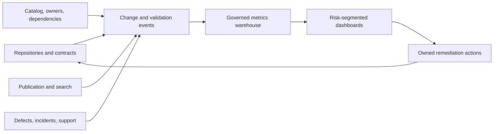

# Documentation success metrics

## 1. Measurement rules

- Measure defined populations, not raw document counts.
- Segment by risk, type, repository, audience, version, and owner.
- Freshness is validation state, not edit recency.
- Every metric has an action threshold and anti-gaming control.
- Targets are set after a baseline and approved by the accountable owner; this
  proposal does not invent numeric enterprise targets.
- Metrics inform decisions; no single metric is a quality verdict.

## 2. Metric catalog

| ID | Metric and exact formula | Population / data source | Cadence / owner | Target method and action threshold | Limitations / anti-gaming |
| --- | --- | --- | --- | --- | --- |
| M01 | **Authority coverage** = active domains with exactly one registered authority ÷ active registered domains | Domain register | Weekly; DGO | Baseline then 100% for R2/R3; any R2/R3 gap blocks publish | A meaningless coarse domain can inflate coverage; audit domain boundaries. |
| M02 | **Owner coverage** = maintained instances with one valid accountable owner ÷ maintained instances | Catalog + identity/CODEOWNERS validation | Weekly; DGO/RM | 100% R2/R3; queue others by risk | Listing inactive teams is not coverage; validate membership and backup. |
| M03 | **Verified freshness** = supported maintained instances in `verified` state ÷ supported maintained instances | Catalog + dependency validations | Daily/weekly; KO | Target by risk after baseline; any invalidated R2/R3 item triggers containment | Do not update timestamps without evidence; require verification reference. |
| M04 | **Dependency response latency** = median(`reverified_or_contained_at - dependency_changed_at`) | Change events + catalog | Weekly; KO/TO | Risk-based SLO; breach pages/queues owner | Missing dependencies hide latency; audit high-change components. |
| M05 | **Escaped documentation defect rate** = confirmed production/user-impacting doc defects ÷ 1,000 published doc changes | Defect tracker + publication log | Monthly; DGO | Downward trend; severity-weighted spike triggers review | Under-reporting lowers rate; provide easy reporting and sample audits. |
| M06 | **Task success** = users completing a defined task without external help ÷ users attempting the task in a test/sample | Usability tests or instrumented journeys | Release/quarterly; CR | Baseline per critical journey; breach creates owned remediation | Analytics proxies do not prove success; use observed tasks for key journeys. |
| M07 | **Search success** = sampled searches where a compatible authoritative result is selected or task completed ÷ sampled searches | Search telemetry + labeled evaluation set | Monthly; CR/TO | Per journey/version; failed top queries drive content/index fixes | Clicks alone can be accidental; combine with dwell/task signals and sampling. |
| M08 | **Duplicate authority rate** = confirmed active duplicate-authority groups ÷ active knowledge domains | Duplicate detector + owner adjudication | Weekly; DGO | Zero confirmed; any R2/R3 duplicate blocks changes to both | Text similarity is only a candidate signal; human confirms authority overlap. |
| M09 | **Generated drift rate** = published generated artifacts differing from reproducible expected output ÷ generated artifacts checked | CI generator comparison | Per change/release; TO | Zero unexplained drift; any failure blocks publish | Generator and source can both be wrong; retain schema review and tests. |
| M10 | **Review effectiveness** = pre-publication valid defects found ÷ all valid defects found within the observation window | Review comments + post-publication defects | Monthly; KO/DGO | Baseline by risk; falling effectiveness triggers checklist/training/rule review | Reviewers may create trivial comments; count validated defects, severity-weighted. |
| M11 | **Remediation time** = median(`verified_fix_at - confirmed_defect_at`) | Defect tracker | Weekly/monthly; KO | Risk-based SLO; breach escalates | Exclude only documented pauses; do not close without verification. |
| M12 | **Documentation debt** = Σ open defect weight where Critical=16, High=8, Medium=3, Low=1 | Confirmed defect/gap register | Weekly; DGO | Budget by risk; Critical=0, High constrained | Weights are a proposal and need calibration; never trade one Critical for many Low closures. |
| M13 | **Knowledge coverage** = required knowledge outcomes with a verified authority or justified no-doc decision ÷ required outcomes sampled | Domain/control/task inventory | Quarterly; KO/CR | Risk-based baseline; gaps receive owner and decision | Document volume is not coverage; the denominator is outcomes, not files. |
| M14 | **Exception health** = unexpired exceptions with owner, controls, and exit evidence ÷ active exceptions | Exception register | Weekly; DGO | 100%; expired blocking exception fails closed | Repeated renewals can hide debt; track age and renewal count. |
| M15 | **AI evidence compliance** = AI-authored material claims with valid evidence/classification ÷ sampled AI-authored material claims | Provenance logs + review sample | Per release/monthly; DGO/KO | 100% for R2/R3; failure triggers workflow containment | Sampling can miss defects; weight by risk and add adversarial tests. |
| M16 | **Authoring toil** = median active contributor minutes per approved normal-risk change, excluding wait time | Workflow telemetry/sample survey | Monthly; DGO | Must not rise beyond approved tolerance without quality benefit | Surveillance and noisy timing are risks; use aggregate, consented, purpose-limited data. |

## 3. Measurement architecture

Text equivalent: repository, catalog, publication, search, defect, incident, and
support events feed a governed metrics store. Risk-segmented dashboards create
owned remediation actions that update authorities and controls.

Required event fields:

`event_id`, `event_time`, `doc_id/domain_id`, `type`, `scope`, `version`,
`risk_tier`, `owner`, `action`, `result`, `evidence_ref`, `tool_version`, and
privacy classification.

## 4. Baselines and targets

1. Collect four to eight weeks or one full release cycle of pilot data.
2. Validate denominator completeness and event quality.
3. Segment by risk and type.
4. Set thresholds based on harm, consumer need, observed capability, and cost.
5. Approve thresholds with the metric owner and affected Knowledge Owners.
6. Revisit after material process/tool changes.

Critical/High safety or authority failures use zero-tolerance gates where
specified; usability and toil measures use trends and action bands.

## 5. Dashboard and alert design

Dashboards MUST show:

- definition, population, window, missing data, and last pipeline validation;
- risk/type/repository/version segments;
- target, trend, action owner, and open remediation;
- exceptions and known measurement limitations.

Alerts MUST be actionable. Each alert links to evidence, affected authorities,
owner, recommended containment, and closure test. An alert without an owner or
action is disabled or redesigned.

## 6. Improvement loop

`measure → validate signal → prioritize by risk → remediate authority/control →
verify closure → watch regression → adjust standard/tool`

Metrics MUST NOT reward document production, word count, edit frequency, or
closure volume. Deleting redundant content can be a positive outcome.

