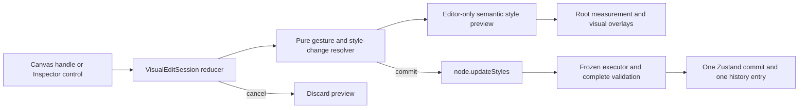

# Phase 5 architecture proposal

## Outcome

Phase 5 should add professional direct manipulation and layout controls without creating another state, style, validation, or mutation architecture. The recommended design adds a transient visual-edit session above the frozen document systems:

1. The Canvas or Inspector starts a local visual-edit session.
2. Pointer or keyboard movement produces an editor-only style preview.
3. The preview rerenders the existing semantic root and is measured by the existing Canvas geometry layer.
4. Commit dispatches one existing `node.updateStyles` command containing all final style changes.
5. Cancel discards the preview and creates no document, dirty-state, commit, or history change.

No application implementation is included in this proposal.

## Problem and evidence

The editor already has a complete command-backed document flow, responsive style resolution, semantic rendering, selection overlays, drag-and-drop, Layers, breadcrumbs, and a minimal Inspector. It does not yet provide direct resizing, visual box-model editing, layout-mode controls, or flex/grid editing.

Verified current constraints:

- [`StyleValues`](../../../src/builder/styles/types.ts) already stores independent dimensions, four-sided spacing, and container-level flex/grid configuration.
- [`node.updateStyles`](../../../src/builder/commands/types.ts) already supports atomic multi-target changes for one viewport.
- The [command executor](../../../src/builder/commands/execute-command.ts) validates JSON safety, style targets, locks, complete `ResponsiveStyles`, and the final project candidate before commit.
- The [builder store](../../../src/builder/store/builder-store.ts) already accepts `historyGroupId` and coalesces adjacent commands without changing the history model.
- The [Canvas](../../../src/builder/ui/editor-canvas.tsx) already registers semantic roots, measures them relative to the artboard, and renders layout-neutral interaction overlays.
- The [Inspector](../../../src/builder/ui/inspector-panel.tsx) currently exposes only text, width, height, padding, and margin; its spacing controls are pixel-only and do not identify inherited versus overridden values.
- The frozen style schema does not contain flex-item fields, grid-item placement/spans, or arbitrary grid track definitions.
- The frozen runtime command catalog does not contain a style-unset/reset command even though `Project.md` describes one.

## Outcomes and non-goals

| Kind | Statement | Measure |
| --- | --- | --- |
| Outcome | Resize eligible selected nodes directly on the Canvas | Pointer and keyboard gestures preview smoothly and commit one undoable style command |
| Outcome | Edit margin and padding from both Inspector controls and Canvas guides | Both properties offer paired X/Y axes or four independent sides; active viewport, locks, and cancellation behave predictably |
| Outcome | Configure the existing flex and grid container fields | Controls appear only for eligible container definitions and compile through the frozen style pipeline |
| Outcome | Make the Inspector registry-aware, responsive-aware, and validation-aware | Controls derive from registry capabilities, show value origin, keep invalid drafts local, and announce results |
| Outcome | Keep all visual affordances outside persisted component data | Saved nodes contain only existing props/styles/meta fields and no overlay or gesture state |
| Non-goal | Publishing, preview services, backend APIs, persistence, authentication, AI, templates, blocks, database, deployment | Not applicable |
| Non-goal | Multi-selection, rotation, freeform positioning, arbitrary transforms, or absolute-position drag | Not applicable |
| Non-goal | Custom breakpoints, new units, arbitrary grid tracks, flex-item sizing, or grid-item spans | Not applicable unless a frozen style-schema exception is separately approved |
| Non-goal | Replacing command execution, hydration, history, registry validation, placement validation, or responsive resolution | Not applicable |

## Frozen boundary

Phase 5 must preserve these rules:

- Persisted changes cross only `dispatchEditorCommand(...)`.
- The implemented command spelling remains `node.updateStyles`.
- `ResponsiveStyles` continues to use `base`, `tablet`, and `mobile` with the existing merge rules.
- Registry style capabilities decide which Inspector and Canvas controls are exposed; component definitions are not dynamically rewritten.
- Locked nodes cannot be visually edited.
- Layout controls never mutate `rootIds`, `childIds`, `parentById`, or placement rules.
- One completed gesture is one Undo operation.
- Semantic renderers keep one root element and receive no editor mode flag.
- Overlay and gesture state is session-only and absent from hydration and saved JSON.

## Proposed architecture



Text equivalent: a Canvas handle or Inspector control starts a local visual-edit session. Pure resolvers calculate draft style changes. The Editor Canvas previews them on the existing semantic root and remeasures overlays. Commit sends one `node.updateStyles` command through the frozen executor and store; cancel discards the preview.

### Transient visual-edit session

The session should live in an `EditorShell`-owned React reducer, not persisted Zustand state. This keeps hydration, page switching, document snapshots, and history unchanged while allowing both Canvas and Inspector controls to share live draft values.

Illustrative contract:

```ts
type ResizeHandle = "east" | "south" | "south-east";
type SpacingProperty = "padding" | "margin";
type SpacingSide = "top" | "right" | "bottom" | "left";

type VisualEditSession =
  | {
      kind: "resize";
      nodeId: NodeId;
      viewport: Viewport;
      handle: ResizeHandle;
      startPointer: { x: number; y: number };
      startRect: CanvasRect;
      previewChanges: NonEmptyReadonlyArray<StyleChange>;
    }
  | {
      kind: "spacing";
      nodeId: NodeId;
      viewport: Viewport;
      property: SpacingProperty;
      side: SpacingSide;
      startPointer: { x: number; y: number };
      previewChanges: NonEmptyReadonlyArray<StyleChange>;
    };
```

Session invariants:

- At most one visual-edit session exists.
- Starting a visual edit is rejected in the UI for a locked, hidden-at-active-viewport, missing, or capability-ineligible node.
- Starting a visual edit cancels any active drag session; drag handles do not activate while a visual edit is active.
- Pointer movement is processed at most once per animation frame.
- `Escape`, pointer cancellation, page switching, selection changes, and node removal discard the preview.
- Pointer release or keyboard commit dispatches one command and then clears the session.
- A rejected command clears the preview, leaves the document unchanged, and exposes the executor reason in the existing live status region.

### Preview integration

`NodeRenderingController` should gain one optional editor-orchestration input for a compiled preview style. It merges that style after the compiled persisted style before calling the pure renderer. Only `EditorCanvas` supplies it; preview and future published callers omit it.

This changes neither the component renderer contract nor saved styles. The preview intentionally changes rendered layout during a gesture; the interaction overlay itself remains layout-neutral.

The Canvas measurement loop should:

- Continue measuring the same semantic root elements.
- Recalculate after preview changes through the existing `ResizeObserver`.
- Batch reads/writes with `requestAnimationFrame`.
- Skip state updates when rectangles are unchanged.
- Keep artboard-relative coordinates as the single geometry coordinate system.
- Treat Canvas zoom as out of scope; Phase 5 calculations assume the current 1:1 artboard scale.

## 1. Resize handle architecture

### Handle set

Under the frozen style schema, normal-flow elements should expose three handles:

- East: width only.
- South: height only.
- South-east: width and height atomically.

North and west handles are intentionally excluded. The schema has no `top`, `left`, or transform offset values, so those handles could not remain under the pointer without changing margins or positioning as an undocumented side effect.

### Eligibility

Handles appear only when:

- A node is selected.
- Its registry definition includes the `sizing` Inspector capability.
- It is not locked.
- Its resolved active-viewport `display` is not `none`.
- No drag-and-drop operation is active.

Small nodes retain minimum 24-by-24-pixel interactive handles positioned outside the semantic content where possible. Handles use buttons or slider-like controls with visible focus, readable labels, and keyboard support.

### Gesture behavior

1. Capture the pointer and the selected root's rendered border-box size.
2. Convert pointer movement into rendered width and/or height in artboard pixels, then derive the persisted unit from the resolved dimension and layout context.
3. Clamp the preview to zero or a product-approved minimum and respect the browser-rendered min/max constraints where they can be resolved reliably.
4. Preview `DimensionValue` changes without mutating the document.
5. Show a measurement badge such as `420 × 240 px`.
6. On commit, dispatch one command with one or two complete dimension values.

Example command output for resizing a normal-flow element to half of its parent's content width while also setting its first explicit height:

```ts
{
  kind: "node.updateStyles",
  pageId,
  nodeId,
  viewport,
  changes: [
    {
      target: { property: "width" },
      value: { mode: "fixed", value: 50, unit: "%" }
    },
    {
      target: { property: "height" },
      value: { mode: "fixed", value: 240, unit: "px" }
    }
  ]
}
```

Width and height remain independent. East does not change height; south does not change width. Resizing an inherited Tablet or Mobile value creates an override only at that active layer.

The final approved resize conversion policy is context-dependent:

- Preserve an existing explicit unit when its CSS conversion basis is valid.
- A first resize of `fill`, `fit`, or `auto` width in normal flow stores a percentage of the measured parent content box.
- A first width resize under `position: absolute` or `position: fixed` stores pixels.
- A first semantic width within one percentage point of the parent width snaps to `fill`.
- A first height resize stores pixels. Existing percentage height is preserved only when the parent-height chain is definite; otherwise it safely falls back to pixels.
- Every gesture still writes only the active responsive layer and emits one final `node.updateStyles` command.

### Keyboard operation

- Arrow keys adjust one pixel.
- `Shift+Arrow` adjusts ten pixels.
- `Enter` commits.
- `Escape` cancels.
- The measurement badge is exposed through an `aria-live` description without announcing every pointer frame.

## 2. Padding and margin editing architecture

### Inspector model

Spacing controls should support:

- Padding and margin default to an Axes mode with only X and Y controls; X updates left/right and Y updates top/bottom.
- All mode exposes top, right, bottom, and left as independent controls for the selected property.
- Units supported by the approved UI subset.
- Margin `auto` where the existing `LengthValue` permits it.
- Clear value-origin badges: Default, Inherited, or Override.
- Local invalid drafts until a complete valid change can be formed.

The adapter should prefer nested field targets so one edge does not overwrite unrelated responsive overrides:

```ts
{
  target: { property: "padding", field: "left" },
  value: { value: 32, unit: "px" }
}
```

If no complete spacing value exists in the resolved cascade, the adapter must instead send one complete four-sided property so the frozen schema never receives an incomplete resolved value. Linked edits use one non-empty change batch and therefore one transaction.

### Canvas model

Spacing handles should appear only while the Inspector's Spacing group is active or a dedicated spacing mode is enabled. This avoids competing with resize and drag handles.

- Padding bands render inside the selected border box.
- Margin bands render outside it.
- One handle appears at the midpoint of each active side.
- Canvas handles use the selected property's Inspector scope: Axes mirrors the dragged value to the opposite horizontal or vertical side, while All changes only the dragged side.
- Dragging away from or toward the edge changes the active side or linked axis.
- Padding and gaps cannot go below zero in Phase 5 UI.
- Margin may be negative; dragging an `auto` margin converts the active side or linked axis to fixed pixels after confirmation through the visible draft state.

Geometry is derived from the semantic root's `getBoundingClientRect()` and computed styles. Margin collapse means a margin overlay is explanatory, not a claim that the band is an independently occupied DOM box.

## 3. Flex layout controls

Flex controls appear only when the selected definition includes `layout`, allows children, and its resolved display is `flex`.

The Layout group should provide:

- Layout mode: Block, Flex, or Grid.
- Direction: row, column, row-reverse, column-reverse.
- Wrap: nowrap, wrap, wrap-reverse.
- Main-axis distribution: flex-start, center, flex-end, space-between, space-around, space-evenly.
- Cross-axis alignment: stretch, flex-start, center, flex-end, baseline.
- Gap with numeric value and unit.

Switching to flex must be atomic. If a resolved flex configuration already exists, only `display` changes and the saved inactive configuration is preserved. If none exists, one command sets `display: "flex"` and this explicit CSS-equivalent initial configuration:

```ts
{
  direction: "row",
  wrap: "nowrap",
  justifyContent: "flex-start",
  alignItems: "stretch",
  gap: { value: 0, unit: "px" }
}
```

The Canvas overlay may show a main-axis arrow and gap markers between direct children while the Layout group is active. These guides are derived from measured child roots and never alter the tree.

The frozen `FlexConfig` supports container settings only. Item order, grow, shrink, basis, and `align-self` are not Phase 5 deliverables unless the style architecture is separately unfrozen.

## 4. Grid layout controls

Grid controls appear only when the selected definition includes `layout`, allows children, and its resolved display is `grid`.

The Layout group should provide:

- Equal-width column count.
- Optional equal-height explicit row count.
- Column gap and row gap.
- `justify-items`: start, center, end, stretch.
- `align-items`: start, center, end, stretch.

Switching to grid must be atomic. If no resolved grid configuration exists, initialize:

```ts
{
  columns: 2,
  columnGap: { value: 16, unit: "px" },
  rowGap: { value: 16, unit: "px" },
  justifyItems: "stretch",
  alignItems: "stretch"
}
```

The Canvas overlay should render derived track lines, numbered columns, and gap bands for the selected grid container. Track guides are computed from the rendered container and direct-child geometry; they are not serialized.

The frozen compiler emits only `repeat(count, minmax(0, 1fr))`. Arbitrary track sizes, named lines, auto-flow, child placement, and row/column span are excluded unless the responsive style architecture is separately unfrozen.

## 5. Inspector improvements

The Inspector should become a composition of small capability-aware sections rather than one monolithic component:

```text
InspectorPanel
  SelectionSummary
  ContentSection       <- definition.inspector.props; visible for text-bearing components
  TypographySection    <- typography; directly follows text-bearing Content
  SizingSection        <- sizing
  SpacingSection       <- spacing
  LayoutSection        <- layout + container context
  BackgroundSection    <- background
  BorderSection        <- border
  PositionSection      <- positioning
```

`SelectionSummary` and `ContentSection` are not style capabilities. Content remains driven exclusively by `definition.inspector.props`. The eight style capabilities below are the complete Phase 5 vocabulary. `background` and `backgroundImage` share one visible Background disclosure but remain separately assignable so color-only components do not receive image controls. No component receives a group by inspecting its current values or semantic tag at runtime.

Phase 5 must implement every field listed for an assigned group and must omit that entire group when the component lacks its registry key. Partial, inferred, or component-name-specific group exposure is not permitted.

### Final style capability groups

| Inspector label | Frozen registry key | Exact Phase 5 fields | Notes and exclusions |
| --- | --- | --- | --- |
| Sizing | `sizing` | `width`, `height`, `minWidth`, `minHeight`, `maxWidth`, `maxHeight` | Width/height support Fill, Fit, Auto, and Fixed. Min/max use existing `LengthValue`. Reset remains governed by P5-D1. |
| Spacing | `spacing` | `margin.top/right/bottom/left`, `padding.top/right/bottom/left` | Padding accepts numeric lengths only in the UI. Margin accepts numeric lengths and `auto`. Flex/grid gap belongs to Layout. |
| Layout | `layout` | `display` modes Block/Flex/Grid; all existing `flex` and `grid` container fields | The Inspector does not use this group to author `display: none`; visibility remains the existing hide/show flow. Item-level flex/grid fields and arbitrary tracks are excluded by P5-D2. |
| Typography | `typography` | `color`, `fontFamily`, `fontSize`, `fontWeight`, `lineHeight`, `letterSpacing`, `textAlign`; Link additionally exposes `textDecoration` | `color` is text color. Link decoration is a component-specific subcontrol inside this existing group; component content still comes from registry prop controls. |
| Background | `background` | `backgroundColor` | Color remains independent and renders behind transparent image pixels. |
| Background layer | `backgroundImage` | one atomic `BackgroundImageValue` | Shares the Background disclosure. Accepts either one decorative HTTPS/root-relative image or one two-color linear gradient with angle and per-color opacity. The active image and gradient replace each other. Uploads, radial gradients, extra stops, overlays, blend modes, and multiple layers remain excluded. |
| Border | `border` | `borderWidth`, `borderStyle`, `borderColor`, `borderRadius` | P5-D7 permits one uniform border. Per-side borders, border images, gradients, outlines, and multiple borders remain excluded. Shadows are component-agnostic Effects under P5-D10, not border fields. |
| Position | `positioning` | `position`, `zIndex` | “Position” is the UI label; the contract key remains `positioning`. No inset fields (`top/right/bottom/left`) or transforms exist. |

Text-bearing components use the presentation order Selection, visible Content, Typography, Sizing, Spacing, Layout, Background, Border, Position, omitting unavailable capabilities. Their registry-declared `text` field is labeled **Text content** and uses a multiline editor; the remaining declared prop controls stay in the same visible Content section. Components without a `text` field retain a collapsed Content disclosure followed by Sizing, Spacing, Layout, Background, Border, and Position as applicable. Every style group, including Typography, remains collapsed by default. Registry array order does not control presentation order.

### Final component capability matrix

| Component | Sizing | Spacing | Layout | Typography | Background color | Background layer | Border | Position |
| --- | --- | --- | --- | --- | --- | --- | --- | --- |
| Section | Yes | Yes | Yes | No | Yes | Yes | Yes | Yes |
| Container | Yes | Yes | Yes | No | Yes | Yes | Yes | Yes |
| Card | Yes | Yes | Yes | No | Yes | Yes | Yes | Yes |
| Heading | Yes | Yes | No | Yes | No | No | No | Yes |
| Text | Yes | Yes | No | Yes | No | No | No | Yes |
| Link | Yes | Yes | No | Yes | Yes | No | Yes | Yes |
| Button | Yes | Yes | No | Yes | Yes | No | Yes | Yes |

Exact assignments:

- **Section:** Sizing, Spacing, Layout, Background color, Background image, Border, Position.
- **Container:** Sizing, Spacing, Layout, Background color, Background image, Border, Position.
- **Card:** Sizing, Spacing, Layout, Background color, Background image, Border, Position.
- **Heading:** Sizing, Spacing, Typography, Position.
- **Text:** Sizing, Spacing, Typography, Position.
- **Link:** Sizing, Spacing, Typography, Background color, Border, Position.
- **Button:** Sizing, Spacing, Typography, Background color, Border, Position.

This matrix records the current component definitions. Phase 5 does not add `layout` to leaf components, does not add `typography` to structural containers, and does not infer Background or Border for Heading/Text merely because the shared style schema contains those properties. The background-layer addenda assign the existing `backgroundImage` capability only to Section, Container, and Card.

### Capability visibility rules

- Render a style group only when its exact registry capability key is present.
- Layout also requires `children.allowed === true`; registry validation tests should preserve the invariant that all current `layout` components are containers.
- Keep an eligible group visible but disabled when the selected node is locked, with the existing lock explanation.
- A node selected through Layers while hidden at the active viewport retains its eligible Inspector groups; only Canvas handles are unavailable.
- Every displayed style value resolves through the active viewport and shows Default, Inherited, or Override origin.
- Do not show empty placeholder groups or controls for fields outside the frozen style schema.
- Adding, removing, or reassigning a capability later is a component-definition contract change and requires registry tests plus proposal re-review.

Inspector rules:

- Render component prop controls from `definition.inspector.props`; do not infer fields from arbitrary schema keys.
- When the declared prop fields include `text`, keep the complete Content section visible and place the eligible collapsed Typography group immediately after it. Other Content sections remain collapsible.
- Key local drafts by node ID, viewport, property, and nested field so selection changes cannot leak drafts.
- Display resolved value and raw layer origin separately.
- Editing an inherited value creates an active-layer override.
- Keep incomplete numbers, temporarily empty fields, and invalid enum transitions local.
- Commit on blur, Enter, selection from a closed choice, or the end of a continuous control interaction.
- `Escape` restores the persisted resolved value.
- Disabled locked controls remain readable and explain why they cannot be edited.
- Rejections render beside the initiating section and remain summarized in the existing live status region.
- Collapsible groups should preserve expansion only as local UI state.

Recommended control primitives:

- `DimensionControl` with mode, value, and unit.
- `LengthControl` with numeric or allowed keyword value.
- `BoxModelControl` with shared Axes/All modes for padding and margin.
- `LayoutModeControl`.
- `FlexControlGroup` and `GridControlGroup`.
- `TypographyControlGroup`, `BackgroundControl`, `BackgroundImageControl`, `BorderControlGroup`, and `PositionControlGroup`.
- `ResponsiveValueBadge` based on raw-layer ownership plus resolved values.

## 6. Visual editing overlays

The existing Canvas interaction overlay should be decomposed by responsibility while preserving one overlay root:

- Selection outline and label.
- Parent outline.
- Drag handle and drop zones from frozen Phase 4.
- Resize handles and measurement badge.
- Spacing bands, side handles, and value badges.
- Flex axis/gap guides.
- Grid track/gap guides.
- Active gesture focus ring and cancellation feedback.

Overlay priority:

1. Active visual-edit handles and measurement feedback.
2. Selected outline and label.
3. Parent outline.
4. Passive layout guides.
5. Empty-container prompt.

Drag-and-drop targets replace visual-edit handles during a drag. Only one overlay interaction owns pointer capture. Every overlay control needs a readable label, visible keyboard focus, and a minimum hit target without changing semantic component layout.

## 7. Required commands and validation

### Command catalog

No new command kind is required for resize, spacing, flex, or grid commits. All persisted changes use the existing `node.updateStyles` contract and may include multiple `StyleChange` values atomically.

The UI may pass a unique `historyGroupId` through the existing dispatcher option for any control that intentionally emits more than one applied command. Pointer resize and spacing gestures should normally preview locally and emit only one final command.

No command may update a tree edge, and `canPlaceType` is not involved because these operations do not change placement.

### Validation layers

| Layer | Responsibility |
| --- | --- |
| Control draft | Parse numeric text, closed choices, link state, and keyword/unit combinations without dispatching incomplete input |
| Visual-edit resolver | Produce finite values, permitted handle axes, complete initialization batches, and ergonomic bounds |
| Registry/capability adapter | Hide or disable controls that the selected definition does not expose; reject locked or missing nodes before gesture start |
| Existing command executor | Validate command shape, target/field, JSON safety, locks, complete responsive styles, and full candidate hydration |
| Browser rendering | Apply CSS layout rules and report measured geometry used for feedback |

Required value rules for Phase 5 UI:

- Width and height gesture results are finite and not negative.
- Padding and flex/grid gaps are finite and not negative.
- Margin is finite and may be negative or use supported keywords.
- Grid columns and explicit rows are positive integers; the recommended Inspector range is 1 through 24 while the command schema remains authoritative.
- Flex and grid choices come from closed UI sets even where the frozen schema currently accepts broader strings.
- Layout-mode initialization sends `display` plus a complete corresponding config in one command.
- Inactive flex/grid data remains stored when display mode changes.
- A command rejection never leaves preview style applied.

## 8. Testing strategy

### Pure unit coverage

Add deterministic tests for:

- East, south, and south-east resize math.
- Pointer cancellation and zero-delta no-op behavior.
- Width/height independence, unit preservation, parent-content percentage conversion, positioned pixel fallback, fill snapping, and percentage-height validity.
- Padding and margin Axes/All direction and scope, negative margins, and nonnegative padding.
- Complete-spacing fallback when the inherited cascade has no complete value.
- Flex/grid initialization and preservation of inactive configurations.
- Responsive origin detection: default, inherited, and override.
- Overlay box, spacing band, track, and gap geometry.

Suggested modules and specs:

- `visual-edit-session.ts` / `__tests__/visual-edit-session.spec.ts`
- `visual-edit-geometry.ts` / `__tests__/visual-edit-geometry.spec.ts`
- `style-change-builders.ts` / `__tests__/style-change-builders.spec.ts`

### Command and store integration

Extend existing executor/store tests to verify:

- Atomic width-plus-height updates.
- Atomic multi-side spacing updates.
- Complete flex/grid initialization at base, tablet, and mobile.
- Lock rejection and source immutability.
- Invalid targets, non-finite values, incomplete nested configs, and invalid grid counts.
- One final gesture command creates one history entry.
- Repeated commands with one existing `historyGroupId` undo as one action.
- Undo/Redo restores responsive visual styles without touching selection or placement.

### React integration

Use behavior-first Testing Library coverage for:

- Handle visibility by selection, capability, display, and lock state.
- Accessible handle labels and keyboard operation.
- One command on pointer release; none on movement or cancellation.
- Conditional Flex/Grid sections and layout-mode switching.
- Registry-driven prop controls for the six current primitives.
- The exact eight-capability vocabulary, canonical display order, and current component capability matrix.
- Border exposing uniform style, width, color/opacity, and radius only, while Position maps to the frozen `positioning` key.
- Invalid drafts remaining local.
- Responsive value badges and active-viewport writes.
- Linked spacing controls producing one atomic batch.
- Overlay/drag mutual exclusion.

### Real-browser validation

Exercise at least:

1. Resize a nested Card in Desktop and Mobile and undo each gesture once.
2. Edit Section padding and sibling margin while verifying live reflow and cancellation.
3. Switch a Container from block to flex, configure direction/alignment/gap, and verify direct children.
4. Switch to grid, configure columns/rows/gaps at Desktop and Tablet, and confirm Mobile inheritance.
5. Verify locked/hidden nodes expose no active Canvas handles.
6. Verify semantic roots remain wrapper-free and saved JSON contains no editor state.
7. Test pointer, keyboard, high-zoom browser text, and small selected elements.

The complete existing suite, TypeScript, ESLint, production build, and rendered visual inspection remain release gates.

## 9. Risks and tradeoffs

| Risk or tradeoff | Impact | Mitigation |
| --- | --- | --- |
| Resize converts Fill/Auto/Fit to Fixed | Direct manipulation necessarily chooses a concrete dimension and may surprise users | Show the resulting mode/value before commit; keep Undo immediate; require explicit approval of pixel commit semantics |
| Normal-flow north/west resize is not representable | Eight handles would imply hidden margin/position changes | Expose east, south, and south-east only under the frozen schema |
| Margin collapse and `auto` margins are not literal boxes | Canvas bands can imply geometry the browser does not reserve independently | Label guides as computed values; document conversion from `auto` to fixed on drag |
| Preview measurement can create ResizeObserver feedback loops | Jitter and high CPU on deep trees | Animation-frame batching, equality checks, one active session, and performance tests |
| Overlay controls can crowd small components | Selection, drag, spacing, and resize affordances may overlap | Interaction modes, priority rules, outside positioning, and minimum hit areas |
| Grid/flex controls can expose unsupported CSS concepts | Users may expect track sizing and item spans | Clearly limit controls to fields present in frozen `StyleValues` |
| Frozen flex strings are broader than the UI choices | Direct non-UI commands can store nonempty strings the Inspector would not offer | Closed UI sets and regression tests; stricter executor semantics require an approved schema change |
| `vw`/`vh` resolve against the browser window, not the artboard div | Responsive Canvas preview is misleading for viewport units | Hide these units from new controls or approve an isolated preview environment before exposing them |
| Responsive override deletion is unavailable | Users cannot return an edited Tablet/Mobile field to inheritance | Resolve the reset-command decision before promising Reset or Auto removal controls |
| Local preview differs briefly from persisted state | Other panels may show stale values during a gesture | Keep the session at `EditorShell`, pass draft values to Canvas and Inspector, and commit/cancel atomically |

## Implementation sequence

1. **Visual-edit foundation:** pure geometry/change builders, `EditorShell` session reducer, preview-style seam, gesture cancellation, and overlay mode arbitration.
2. **Resize vertical slice:** east/south/south-east handles, keyboard behavior, measurement badge, one-command commit, lock/viewport tests.
3. **Inspector foundation:** section decomposition, registry-driven prop controls, draft/error model, unit controls, and responsive origin badges.
4. **Spacing vertical slice:** property-specific Inspector spacing modes, Canvas padding/margin modes, live preview, atomic commit, negative/auto margin behavior.
5. **Flex vertical slice:** layout-mode switch, full flex controls, initialization, axis/gap guides, responsive tests.
6. **Grid vertical slice:** equal-track controls, row/column gaps, alignment, track guides, responsive cascade tests.
7. **Professional polish:** collision/crowding rules, pointer/keyboard accessibility, performance tuning, error announcements, and cross-viewport browser validation.
8. **Validation report:** enumerate final architecture, behavior, tests, browser evidence, deviations, and unresolved limits; stop for review.

Each vertical slice must leave the full suite green and must not begin publishing, backend, persistence, authentication, AI, template, block, database, or deployment work.

## Finalized design decisions

The accountable user approved these resolutions on 2026-08-07. None unfreezes a Phase 1 through Phase 4 architecture boundary.

| ID | Final resolution | Status |
| --- | --- | --- |
| P5-D1 | Keep the command architecture frozen and defer every reset/unset control. Do not encode inheritance as `null` and do not copy inherited values into overrides as a reset surrogate. | Approved and intentionally deferred |
| P5-D2 | Limit flex and grid editing to container-level fields already present in the frozen style schema. | Approved |
| P5-D3 | Canvas east, south, and south-east resize gestures initially committed fixed pixels; the post-validation sizing addendum supersedes this with context-dependent, unit-preserving conversion. | Approved, then amended by the accountable user |
| P5-D4 | New controls author only px, %, rem, and em. Existing vw/vh values remain displayable but are not newly authored. | Approved |
| P5-D5 | Keep live gesture state local to `EditorShell`, apply editor-only preview styles, and issue one final existing command per completed gesture. | Approved |
| P5-D6 | Clamp direct-manipulation width and height to a stored minimum of 0px while preserving a 24px interaction target. | Approved |
| P5-D7 | Extend the responsive style contract with optional uniform `borderWidth`, `borderStyle`, and `borderColor` fields; keep radius; initialize a missing visible border as `1px solid #000000` in one existing command; preserve registry assignments, responsive cascade, hydration/history, and the reset/unset deferral. | Approved by the accountable user on 2026-08-10 |
| P5-D8 | Add an optional atomic `backgroundImage` value with explicit `none` and `image` variants; accept one safe HTTPS or root-relative decorative image; expose the capability only on Section, Container, and Card; keep uploads, semantic images, overlays, and multiple layers excluded. | Approved by the accountable user on 2026-08-10 |
| P5-D9 | Add optional responsive `textDecoration` with `none`, `underline`, `overline`, and `line-through`; expose it only for Link inside the existing Typography group; keep underline as the new-Link default and retain Link version 1 with no migration. | Approved by the accountable user on 2026-08-10 |
| P5-D10 | Add optional responsive `boxShadow` and `backdropBlur` values to the shared style contract, expose Effects on every component, and render visual component-library previews from the same resolved templates and compiler used by Canvas and Preview. Keep semantic interactions separate from generic visual effects. | Approved by the accountable user on 2026-08-11 |

### Shared effects and component-preview parity follow-up

On 2026-08-11, the accountable user approved one builder-wide source of truth for component visuals:

- `boxShadow` stores an ordered atomic list of at most four inset or outer shadows. Each shadow stores finite horizontal and vertical offsets, nonnegative blur, finite spread, one `px`/`rem`/`em` unit, and color. An empty list explicitly removes inherited shadows at a narrower viewport.
- `backdropBlur` stores one finite nonnegative `px`/`rem`/`em` length and compiles to the standard and WebKit backdrop-filter properties.
- Effects are available on every component through one universal Inspector group; they are not a Button prop or a per-component capability.
- The existing `base -> tablet -> mobile` resolver, `node.updateStyles` command, candidate validation, history, Undo/Redo, semantic renderer, Canvas, and Preview carry the values. The optional fields require no project or component version bump.
- Visual component-library thumbnails resolve the actual component or block template and compile the resolved Desktop styles. Thumbnail CSS is limited to its neutral surface, scale, clipping, and pointer suppression.
- Button presets now express raised, glass, and glow looks through the shared background, border, shadow, and blur values. Solid primary also uses the registry default directly.
- Arrow icon motion remains a semantic Button interaction. Library and Canvas share the same rendered icon markup, data attribute, and interaction selector; generic effects do not introduce a second transform or state architecture.

This follow-up removes duplicated Button-thumbnail styling without adding a renderer wrapper, command kind, store field, responsive layer, placement rule, persisted interaction state, or publishing behavior. Generic hover/focus/active style authoring remains outside this bounded effects change.

### Link text-decoration follow-up

On 2026-08-10, the accountable user approved a bounded Link decoration control:

- The responsive style contract accepts one optional `textDecoration` value from `none`, `underline`, `overline`, or `line-through`.
- Link alone exposes **Text decoration** inside its existing Typography group. Heading, Text, and Button do not receive the control, and no registry capability key is added.
- New Links store `underline` explicitly in their base defaults, preserving the browser's existing visual default while making the authored value deterministic.
- The existing schema, responsive merge, style-command allowlist, shared editor/Preview compiler, candidate hydration, history, and Undo paths carry the value.
- Link remains component version 1 because its props shape and semantic renderer contract are unchanged; existing Links require no migration.
- Decoration color, thickness, style, offset, skip-ink, and combined decoration lines remain outside this follow-up.

This follow-up adds no command kind, store field, history behavior, responsive layer, renderer wrapper, placement rule, or publishing behavior.

### Post-validation sizing addendum

On 2026-08-07, the accountable user approved a bounded sizing refinement after the initial Phase 5 validation:

- Inspector Sizing exposes Width and Height only. Min/Max Width/Height remain valid persisted style fields for backward compatibility but are not authored by this UI.
- Fill is labeled Fill page for roots and Fill parent for nested nodes.
- Page-root height additionally exposes semantic Fill viewport. At initial approval, runtime compilation used a growable `100vh` minimum, while the editor substituted the selected Canvas artboard height (Desktop 42 rem, Tablet 48 rem, Mobile 52.75 rem) so preview behavior was independent of the browser window. The runtime unit is superseded by the dynamic-viewport follow-up below.
- General numeric unit controls remain limited to px, %, rem, and em. Fill viewport is a semantic choice, not raw vh authoring.
- Visual resize preserves an existing explicit unit when its basis is valid. First normal-flow `fill`/`fit`/`auto` width resize stores parent-content-box percent; absolute/fixed positioned width stores px; semantic widths within one percentage point of 100% snap to `fill`.
- First height resize stores px. Existing percentage height is preserved only when its parent height is definite.
- Conversion is measurement-only editor logic. The existing active-layer `node.updateStyles` command, transaction, history, and `base -> tablet -> mobile` cascade remain authoritative.

This addendum extends the responsive dimension value/schema/compiler only for semantic viewport fill and changes only Canvas resize conversion for proportional sizing. It does not change command execution, registry capabilities, hydration flow or migrations, Zustand/history state, responsive cascade, or placement validation.

### Dynamic viewport follow-up

On 2026-08-10, the accountable user approved the responsive sizing recommendation with these bounded semantics:

- Normal Fill page and Fill parent width continues to compile to `100%`; components are not forced into percentage sizing.
- Page-root Fill viewport height compiles to `height: auto` plus `min-height: 100dvh`, allowing content to grow while tracking the visible dynamic viewport.
- The editor continues substituting the selected Canvas artboard-height variable, so editor preview behavior remains independent of browser chrome.
- Existing persisted viewport-width values continue to compile to `100vw` for compatibility. The Inspector does not author viewport width.

This follow-up changes no persisted value, schema, migration, responsive cascade, command, history behavior, or placement rule.

### Container presentation follow-up

On 2026-08-10, the accountable user approved a bounded correction to the default Container presentation and its empty Canvas state:

- New Container nodes use zero vertical padding and responsive horizontal gutters: 24 px at Desktop, 20 px at Tablet, and 16 px at Mobile.
- An empty, auto-height Container receives a 48 px editor-only minimum height so its prompt, selection outline, and drop target occupy centered layout space instead of extending only below a zero-height root.
- The editor minimum is removed as soon as the Container has a child and does not override explicit height, minimum-height, or viewport-height values.
- Published rendering receives only the persisted responsive horizontal padding. The 48 px minimum is composed by `EditorCanvas` and is not stored in component styles or hydration data.

This correction intentionally makes the otherwise zero-height semantic Container occupy its 48 px interaction area while it is empty in the Canvas. It is a narrow exception to the earlier layout-neutral empty-prompt rule; it does not change renderer contracts, schemas, migrations, commands, history, responsive resolution, placement, or existing stored Container nodes.

### Uniform border-support follow-up

On 2026-08-10, the accountable user approved the recommended uniform border design in the [border-support implementation plan](Border-Support-Implementation-Plan.md):

- Add optional flat `borderWidth`, `borderStyle`, and `borderColor` style fields beside the existing `borderRadius`.
- Restrict border style to None, Solid, Dashed, or Dotted.
- Restrict border width to finite nonnegative `px`, `rem`, or `em` values; percentages, viewport units, keywords, and negative values are invalid.
- When a user selects a visible style without a usable inherited width or color, commit the selected style, `1px` width, and `#000000` color atomically through one existing `node.updateStyles` command.
- Selecting None preserves inactive width, color, and radius values. Width/color stay disabled while None is resolved; radius remains independently editable.
- Keep the existing `border` registry capability assignments: Section, Container, Card, and Button expose the group; Heading and Text do not.
- Preserve schema-version-1 compatibility for existing documents by making the fields optional; no document or component migration is required while persistence/export and cross-version exchange remain excluded.
- Keep per-side borders, per-corner radii, border images, gradients, outlines, multiple borders, Canvas border handles, and reset/unset behavior out of the border scope. P5-D10 separately permits reusable shadows in Effects.

This is a bounded exception to the earlier radius-only style boundary. It extends type/schema validation, the flat responsive cascade, CSS compilation, and the existing command property allowlist only for the three approved fields. It does not add a command, store field, history mechanism, registry capability, renderer seam, placement rule, prop, wrapper, or editor-only persisted state.

### Responsive background-image follow-up

On 2026-08-10, the accountable user approved the bounded plan in [Background-Image-Implementation-Plan.md](Background-Image-Implementation-Plan.md):

- Add one optional atomic `backgroundImage` responsive value. `{ kind: "image" }` stores a safe source, Cover/Contain/Auto sizing, horizontal and vertical position, and repeat mode; `{ kind: "none" }` suppresses an inherited image at a narrower viewport.
- Accept only trimmed HTTPS URLs or same-origin root-relative paths up to 2,048 characters. Reject protocol-relative, HTTP, data, blob, JavaScript, credential-bearing, malformed, controlled-character, and overlong sources before mutation.
- Expose the image capability only on Section, Container, and Card. Button and Link retain color-only Background controls; Heading and Text retain no Background group.
- Treat background images as decorative. The Inspector directs meaningful content to a future semantic Image component.
- Keep background color independent so it remains the fallback behind transparent pixels.
- Preserve the existing `node.updateStyles` command, complete-value validation, history, responsive cascade, semantic renderer, and preview compiler.
- The initial image follow-up excluded uploads, asset storage, base64/blob persistence, multiple layers, gradients, blend modes, overlays/image opacity, and arbitrary CSS. The later two-color linear-gradient addendum supersedes only the blanket gradient exclusion.

This is an additive optional style-contract change and requires no current-document migration. A document containing the new field is not guaranteed to hydrate in an older strict-schema build; durable cross-version exchange remains outside the delivered product scope.

### Two-color linear-gradient follow-up

On 2026-08-10, the user requested gradient colors for component backgrounds. The bounded implementation extends the same atomic `backgroundImage` value rather than adding another style property or layer:

- `{ kind: "linear-gradient" }` stores an angle from 0 through 360 degrees plus start and end colors.
- Gradient colors accept `transparent` or safe three-, four-, six-, or eight-digit hex notation. The existing color controls provide independent opacity through four- or eight-digit hex values.
- Add, edit, and remove actions write one complete responsive value through the existing `node.updateStyles` command. A gradient and image replace each other; they do not stack.
- Section, Container, and Card retain the existing `backgroundImage` capability. The component capability matrix, command catalog, responsive cascade, hydration version, store/history shape, renderer contract, and placement rules remain unchanged.
- Radial gradients, extra color stops or stop positions, blend modes, overlays, animation, arbitrary CSS, and multiple layers remain excluded.

The implemented source, schema, compiler, Inspector, editor renderer, preview renderer, and tests are authoritative. This draft addendum remains pending accountable owner review with the rest of the Phase 5 proposal.

Any later choice that adds reset operations, item-level layout fields, new validation semantics, custom breakpoints, or an iframe preview is a separate architecture change and requires explicit unfreezing before implementation.

## Requirements and acceptance evidence

| ID | Requirement | Priority | Acceptance evidence |
| --- | --- | --- | --- |
| P5-01 | Canvas resizing uses eligible external handles and one command per completed gesture | Must | Unit, React, store-history, Undo/Redo, and browser evidence |
| P5-02 | Padding and margin editing support paired Axes and independent All-side modes while preserving responsive layers, preview, commit, and cancel | Must | Change-builder, Inspector, Canvas, responsive, and browser tests |
| P5-03 | Existing flex container fields are fully editable | Must | Conditional Inspector, compiler, responsive, and rendered layout tests |
| P5-04 | Existing grid container fields are fully editable | Must | Conditional Inspector, compiler, responsive, and rendered layout tests |
| P5-05 | Inspector controls derive from the finalized capability matrix and explicit registry prop metadata | Must | Exact vocabulary, order, current component matrix, and prop-control integration tests |
| P5-06 | Overlays remain editor-only, accessible, and mutually exclusive with drag operations | Must | DOM/persistence assertions, keyboard tests, and browser inspection |
| P5-07 | Rejections, locks, invalid drafts, and cancellation leave the document atomic | Must | Executor/store/UI failure-path tests |
| P5-08 | Phase 1 through Phase 4 frozen systems remain unchanged in authority and behavior | Must | Full regression suite and Phase 5 validation report |
| P5-09 | Registry-eligible components support accessible, responsive uniform border width, style, color/opacity, and radius controls through the existing command/rendering pipeline | Must | Style/schema/compiler, hydration, executor/history, Inspector, semantic rendering, preview, and real-browser evidence |
| P5-10 | Section, Container, and Card support one safe responsive decorative background image through the existing style, command, editor, and preview pipelines | Must | Schema/compiler, hydration, executor/history, capability, Inspector, responsive removal, lock, and preview tests |
| P5-11 | Section, Container, and Card support one responsive two-color linear gradient with angle and per-color opacity through the same atomic background layer | Must | Safe schema/compiler, hydration, responsive cloning, executor/history, Inspector, image replacement, lock, editor, preview, and browser tests |
| P5-12 | Every component supports responsive shadows and backdrop blur through the shared style pipeline, and rendered library thumbnails match their inserted Canvas and final Preview output | Must | Schema/resolver/compiler, command, universal Inspector, non-Button Card, all eight Button presets, Canvas, Preview, and computed-style browser parity tests |

## Approval and change control

This document is a draft D1 feature specification and architecture proposal. It requires an accountable product/architecture owner to:

1. Approve or amend the scope.
2. Record decisions P5-D1 through P5-D10.
3. Confirm that any exception to a frozen boundary is handled as a separate approved architecture change.
4. Authorize implementation only after those decisions are resolved.

Further changes to the command catalog, responsive style schema beyond the sizing, uniform-border, background-layer, Link text-decoration, and shared-effects addenda, component registry contract beyond the Container-presentation and background-image capability addenda, hydration, history, or placement validation invalidate this proposal and require re-review. Completion should produce one Phase 5 validation report and update this workspace; it should not rewrite the frozen Phase 4 documents.
