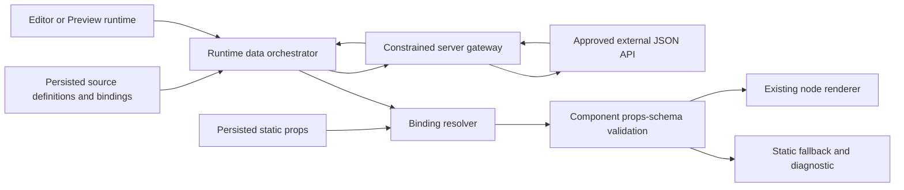

# API data sources and dynamic bindings specification

## Outcome

After this feature is delivered, an author can define an approved JSON API data source, test it, inspect a sanitized response, and bind an eligible component property to a response value. The component retains its authored static property as the fallback. Preview resolves the binding without putting fetched responses, request state, or credentials into the persisted project document.

The first deliverable is deliberately narrow: public REST-style JSON `GET` requests, scalar component-property bindings, explicit testing in the editor, and page-load execution in Preview. Collection rendering, mutation requests, arbitrary event graphs, GraphQL, and private credentials follow only after this foundation is verified.

This document is a draft feature specification, not a statement that the feature exists. `Project.md` and the code under `src/` remain authoritative for current behavior.

## Classification of statements

- **Verified** describes behavior confirmed in the current source tree.
- **Proposed** describes the recommended design in this specification.
- **Deferred** describes work intentionally excluded from the first delivery.
- **Decision required** identifies a choice that must be approved before implementation.

## Problem and evidence

The builder can author static JSON-compatible component properties and can submit visitor form data to one same-origin Route Handler. It cannot retrieve external data and map it into rendered component properties.

| Verified observation | Evidence | Consequence |
| --- | --- | --- |
| Project schema version 1 stores pages and nodes but has no data-source collection. | `src/builder/model/project-document.ts` | There is no persisted identity or configuration for an API source. |
| A node stores static `props`, responsive `styles`, metadata, and child IDs; it has no binding contract. | `src/builder/model/project-document.ts` | A renderer cannot distinguish authored fallback content from a dynamic value. |
| Hydration uses strict Zod envelopes and rejects unknown project or node fields. | `src/builder/project/hydration.ts` | Data sources and bindings require an explicit document migration and validation stages. |
| Document migrations are supported, but the migration list is empty because the current schema is version 1. | `src/builder/project/migrations.ts` | The feature can add a controlled version 1 to version 2 migration. |
| The node renderer passes `node.props` directly to the registered component renderer. | `src/builder/rendering/node-rendering-controller.tsx` | Dynamic resolution belongs immediately before the component renderer, not inside every component. |
| Renderer runtime context exposes editor/Preview mode and optional form submission only. | `src/builder/registry/define-component-registry.ts` | Data execution and diagnostics need an explicit runtime boundary. |
| Preview consumes a validated one-use project snapshot from same-origin browser storage. | `src/builder/preview/preview-snapshot.ts` and `src/builder/preview/preview-shell.tsx` | Unsaved public source definitions can travel with Preview, but server-side credentials cannot. |
| The current `/api/form-submissions` route validates inbound JSON and only acknowledges it. | `src/app/api/form-submissions/route.ts` | Existing API code is an outbound form-submission boundary, not a general external-data executor. |
| Undo history snapshots include name and page content but no future project-level data-source collection. | `src/builder/store/builder-store.ts` | The history contract must expand when project-level data sources become editable. |
| Inspector controls are generated from registry-declared top-level prop fields. | `src/builder/ui/inspector-panel.tsx` | Initial binding targets can be limited to those existing eligible prop fields. |

## Outcomes and non-goals

| Kind | Statement | Measure |
| --- | --- | --- |
| Outcome | Authors can add, rename, edit, test, disable, and remove a public JSON `GET` data source. | Observable editor behavior and command tests cover the complete lifecycle. |
| Outcome | Authors can bind an eligible scalar component prop to a selected response path. | The binding persists, hydrates, survives Undo/Redo, and resolves in Canvas data preview and Preview. |
| Outcome | Static props remain valid authored fallbacks. | Missing, loading, failed, or type-incompatible dynamic values never erase or corrupt the static prop. |
| Outcome | Components remain unaware of networking. | Existing component renderers continue receiving validated resolved props. |
| Outcome | External requests cross one constrained server boundary. | No component renderer or arbitrary user script calls an external API directly. |
| Outcome | Runtime response data remains ephemeral. | Serialized projects and Preview snapshots contain definitions and bindings, never fetched response bodies or request state. |
| Outcome | Failure is visible and recoverable. | Editor and Preview expose accessible source diagnostics without crashing unrelated page content. |
| Non-goal | General-purpose JavaScript expressions, `eval`, or user-authored executable transforms. | Not applicable. |
| Non-goal | Secret-bearing headers, OAuth, private tokens, or authenticated connectors in the first delivery. | Not applicable. |
| Non-goal | `POST`, `PUT`, `PATCH`, `DELETE`, webhooks, or form-to-arbitrary-endpoint actions in the first delivery. | Not applicable. |
| Non-goal | GraphQL, WebSockets, subscriptions, streaming, or realtime synchronization in the first delivery. | Not applicable. |
| Non-goal | Array repetition, pagination, filtering expressions, dependent queries, or event-action graphs in the first delivery. | Not applicable. |
| Non-goal | Durable project persistence, publishing, deployment, or production credential storage. | Not applicable; these remain dependencies for production authenticated execution. |
| Non-goal | Dynamic style bindings or responsive prop variants. | Not applicable; the initial target is eligible component props only. |

## Users and journeys

### Primary user

The primary user is a website author working in the visual editor. They understand the API response fields they want to display but should not need to write JavaScript.

### Create and test a source

1. The author opens a dedicated **Data** panel.
2. They choose **Add data source** and select **REST JSON**.
3. They enter a readable name and a public `https://` URL for a `GET` request.
4. They select **Test connection**. Testing is explicit; merely opening a project does not send editor requests without the approved runtime mode.
5. The editor announces loading, success, or failure and displays a bounded, sanitized response explorer.
6. The author selects a response field or copies its displayed data path.

### Bind a component property

1. The author selects a component and opens an eligible Content field in the Inspector.
2. They switch the field from **Static** to **Connected**.
3. They choose a data source and response path.
4. The editor validates the sample value against the complete component prop schema.
5. The Canvas shows the resolved sample value when data preview is enabled; otherwise it shows the static value with a connected-state indicator.
6. The author can return the field to **Static** without losing the existing static value.

### Preview runtime behavior

1. The author opens Preview with the current one-use project snapshot.
2. Preview discovers the enabled sources referenced by the active page.
3. Each unique source executes once for the page-load request key.
4. Bound components initially use their static fallback.
5. When valid JSON arrives, affected bindings resolve and only their consumers rerender.
6. A missing path, request failure, or invalid value keeps the static fallback and exposes a non-secret diagnostic.

### Accessibility and localization

- Data-source controls, response paths, binding state, and request status must be operable by keyboard and exposed with accessible names.
- Loading, success, and failure cannot be communicated by color alone.
- The response explorer must use a semantic tree or list pattern with bounded depth and meaningful labels.
- User-facing status messages must avoid embedding raw response bodies or server error details.
- Dynamic text is external content. Localization ownership remains with the source; the builder does not silently translate it.

## Proposed architecture



Text equivalent: the project stores static props, source definitions, and binding references. A runtime orchestrator asks a constrained server gateway to retrieve approved JSON. The binding resolver overlays valid response values on static props, validates the complete candidate with the existing component schema, and then calls the existing node renderer. Any unavailable or invalid dynamic value leaves the static fallback in place and records a diagnostic.

### Architectural rules

1. Component renderers do not call `fetch` and do not know which source produced a value.
2. Static `props` remain the complete valid fallback contract for every node.
3. `bindings` describe references; they do not store response values or executable expressions.
4. Source definitions are project-scoped so many nodes can share one request and one response state.
5. Runtime response data, request status, timestamps, and errors are session state and are never serialized into the project document or undo history.
6. Source and binding authoring changes are document changes and participate in the existing command, dirty-state, autosave, and history flow.
7. The resolver uses own-property JSON traversal only. It never reads prototypes or evaluates a path as JavaScript.
8. A resolved component prop candidate must pass the registered component's complete `propsSchema` before rendering.
9. The gateway is the only external-network boundary. CORS workarounds and direct credential use in the browser are prohibited.
10. A deployment can disable external execution without preventing static documents from loading or rendering.

## Proposed persisted model

The first schema that implements this feature should increment `CURRENT_PROJECT_SCHEMA_VERSION` from `1` to `2`. Version 2 adds a required project-level source collection and order, plus an optional node binding map. Names are illustrative TypeScript, not implementation code.

```ts
type DataSourceId = string & { readonly __brand: "DataSourceId" };

type DataPathSegment = string | number;

type RestJsonDataSource = {
  id: DataSourceId;
  name: string;
  kind: "rest-json";
  enabled: boolean;
  request: {
    method: "GET";
    url: string;
    query: Record<string, string>;
  };
};

type DataBinding = {
  sourceId: DataSourceId;
  path: DataPathSegment[];
  unavailable: "use-static";
};

type ProjectDocumentV2 = ProjectDocumentV1 & {
  schemaVersion: 2;
  dataSources: Record<DataSourceId, RestJsonDataSource>;
  dataSourceOrder: DataSourceId[];
};

type BuilderNodeV2 = BuilderNodeV1 & {
  bindings?: Record<string, DataBinding>;
};
```

### Why the path is an array

The UI can display a friendly path such as `products[0].name`, but persistence stores `['products', 0, 'name']`. This avoids ambiguous escaping and prevents a string expression from becoming an execution mechanism. The resolver accepts finite JSON arrays and own properties only, enforces bounded path length, and returns an unavailable result instead of throwing when traversal fails.

### Binding target rules

- A binding-map key is an Inspector-declared prop path for that component definition.
- The initial feature supports top-level prop fields already represented by the registry Inspector.
- A field is eligible only when the component definition marks or derives it as safely bindable.
- `styles`, `meta`, `childIds`, component types, URLs with security behavior, and structural fields are not generic binding targets.
- A component definition may explicitly exclude a field even when it appears in the Inspector.
- Binding output does not mutate `node.props`; the static authored value remains in the document.

### Source deletion and duplication

- Removing an unreferenced source is one undoable command.
- Removing a referenced source is rejected until the author reviews its consumers and disconnects them. The first delivery does not silently delete bindings.
- Duplicating a node copies its bindings and continues referencing the same project source.
- Future cross-project copy must either map a compatible source or disconnect the binding with a visible warning; it must not create an unresolved source ID silently.

## Runtime data model

Runtime state is stored separately from `BuilderStoreState.document`:

```ts
type RuntimeDataSourceState =
  | { status: "idle" }
  | { status: "loading"; requestKey: string }
  | {
      status: "success";
      requestKey: string;
      data: JsonValue;
      receivedAt: string;
    }
  | {
      status: "error";
      requestKey: string;
      code: DataSourceErrorCode;
    };

type RuntimeDataState = Record<DataSourceId, RuntimeDataSourceState>;
```

The concrete state manager may be a dedicated Zustand vanilla store or a runtime controller owned by the page renderer. It must not be part of document snapshots, autosave, or Undo/Redo.

### Request lifecycle

1. Collect enabled sources referenced by bindings on the active page.
2. Build a deterministic request key from the source ID, approved public configuration, and runtime variables.
3. Deduplicate identical in-flight requests.
4. Mark the source loading while components continue using static fallbacks.
5. Execute through the constrained server gateway with cancellation support.
6. Validate that the response is bounded JSON before accepting it.
7. Store success or a stable error code in runtime state.
8. Resolve only affected binding consumers.
9. Ignore or abort stale results after page, project revision, source configuration, or request key changes.
10. Clear runtime state when its owning Preview or editor data-preview session ends.

The first delivery uses page-load execution and in-session request deduplication. Cross-request TTL caching requires a separate approved policy because freshness requirements differ by source.

### Binding-resolution algorithm

For each node:

1. Start with a clone of the validated static `node.props`.
2. For each binding, find the matching runtime source state.
3. If the source is unavailable, loading, or failed, retain the static field value.
4. If the source succeeded, traverse the path through own JSON properties and array indices only.
5. Tentatively replace that one field in the candidate props.
6. Validate the complete candidate through the component definition's `propsSchema`.
7. If validation passes, retain the dynamic value.
8. If validation fails, restore the static field and record a bounded `type-mismatch` diagnostic.
9. Pass the final validated props to the existing component renderer.

A binding failure affects its own value, not the complete page. Hydration remains stricter: malformed persisted bindings reject the document because they are authored data defects.

## Server execution boundary

### Initial public-source gateway

The first delivery may expose an editor test endpoint that accepts a public `GET` source definition because durable server-side project storage does not yet exist. The endpoint must independently validate the complete definition and apply the same network safety policy as runtime execution. It must not accept credential references or arbitrary headers.

An illustrative route is:

```text
POST /api/data-sources/test
```

The request contains the proposed public source configuration. The response contains a bounded JSON sample or a stable error code. It does not echo internal network errors, resolved addresses, headers, or response bodies on failure.

### Production runtime gateway

Credentialed or published runtime execution must not trust a browser-supplied URL. Its request should identify a stored project revision and source:

```text
POST /api/runtime-data/execute
{ projectId, revision, pageId, sourceId, variables }
```

The server loads the trusted source definition, applies authorization and deployment policy, resolves any server-side credential reference, executes the request, validates the response, and returns bounded JSON. This production path depends on durable project persistence, authentication, authorization, and a credential store that are not present in the verified baseline.

## Security, privacy, and reliability constraints

External network execution is an R2 documentation and implementation area. A security reviewer must approve the executor and its tests before it is enabled outside a local development environment.

| Boundary or risk | Required control |
| --- | --- |
| Server-side request forgery | Allow only approved `http`/`https` URLs; enforce deployment policy; reject loopback, link-local, private, metadata-service, unsupported-port, and otherwise prohibited destinations; validate every redirect and resolved destination. |
| DNS rebinding and redirects | Resolve and verify destinations through one hardened network service, re-check redirects, and never fall back to a generic unrestricted fetch path. |
| Secrets | Never store keys, tokens, cookies, passwords, or private header values in the project document, Preview snapshot, browser state, response explorer, URLs, logs, or diagnostics. |
| Request abuse | Apply deployment-configured timeout, redirect, concurrency, rate, and retry limits. The initial feature performs no automatic retry unless policy explicitly enables it. |
| Oversized or hostile responses | Enforce deployment-configured byte, depth, collection, and parsing limits before accepting JSON. Reject unsupported content instead of coercing it. |
| CORS | Execute through the server boundary. Do not disable browser security or inject permissive client proxies. |
| Arbitrary code | Prohibit JavaScript expressions, `eval`, dynamic function construction, script URLs, and user-authored executable transforms. |
| Prototype access | Resolve path segments with own-property checks and safe array indexing; never traverse object prototypes or assign through untrusted paths. |
| Unsafe rendered values | Revalidate complete component props after resolution. Existing URL, rich-text, and component-specific validation remains authoritative. |
| Sensitive response data | Treat samples and runtime data as ephemeral. Do not persist them, include them in history, or log their bodies. Provide an explicit clear action in the editor. |
| Error disclosure | Return stable user-facing error codes. Keep raw upstream errors restricted to approved server observability with redaction. |
| Stale requests | Cancel or ignore results whose project revision, page, source version, or request key no longer matches. |
| Availability | Keep valid static fallbacks, isolate source failures, and allow deployments to disable the executor without breaking static rendering. |

No concrete timeout, size, retention, cache duration, allowlist, or rate-limit value is invented here. Those values require an approved deployment policy and representative load/security testing.

## Editor experience

### Data panel

Add a project-level **Data** panel rather than placing source configuration inside component props. It provides:

- Source list and referenced-component count
- Add, rename, duplicate, enable/disable, and delete actions
- Public `GET` URL and query-parameter controls
- Explicit **Test connection** and **Refresh sample** actions
- Accessible loading, success, and failure status
- Sanitized JSON response explorer with selectable paths
- A clear statement that test responses are temporary
- Consumer navigation from a source to the components that reference it

### Inspector binding control

Each eligible field keeps its existing static editor and adds:

- **Static** and **Connected** modes
- Source selection
- Response-path selection
- Current fallback value
- Sample compatibility status
- Disconnect action
- Source error or unavailable status without displaying sensitive response content

Locked components remain read-only. Disconnecting a binding restores normal static editing because the static value was never replaced.

### Canvas data preview

Canvas data preview is explicit and independently controllable from normal editing. A project may be opened without automatically executing external sources. The first implementation should support:

- Static mode, which performs no data request and renders static props
- Data-preview mode, which uses manually tested sample/runtime state
- Clear and refresh controls
- A visible indication when Canvas content is externally connected

The exact default for Canvas auto-execution is a decision required before implementation. The safe initial recommendation is static mode until the author explicitly tests or enables data preview for the session.

## Commands, history, and persistence

Add explicit commands rather than mutating document objects from the UI:

- `dataSource.add`
- `dataSource.update`
- `dataSource.rename`
- `dataSource.enable`
- `dataSource.remove`
- `node.setBinding`
- `node.removeBinding`

Every applied command must validate its candidate document and commit atomically. Data-source and binding edits set the document dirty and are undoable. Runtime response state is neither dirty nor undoable.

`DocumentContentSnapshot` must include `dataSources` and `dataSourceOrder`; otherwise Undo/Redo would restore page bindings without restoring the matching source definitions. Autosave and future persistence must serialize version 2 definitions and bindings but exclude runtime data.

## Migration and compatibility

### Version 1 to version 2

The document migration should:

1. Require a valid schema version 1 input.
2. Add `dataSources: {}`.
3. Add `dataSourceOrder: []`.
4. Leave every existing node's static props and component version unchanged.
5. Set `schemaVersion: 2`.
6. Pass the complete strict envelope, tree, component, style, placement, source, and binding validation pipeline.

Existing projects therefore render identically after migration. Component versions do not increase merely because the project envelope learns about bindings.

### Hydration validation additions

Hydration must validate:

- Source record keys equal embedded IDs.
- Source names are non-empty and order contains each source exactly once.
- Source kinds and request contracts are known and strictly shaped.
- URLs, query values, data-path segments, and configuration sizes are bounded.
- Every binding references an existing source.
- Every binding target exists and is eligible for the component type.
- Paths are finite JSON data paths, not expressions.
- Static props still pass the component schema independently of runtime data.

Add explicit `data-source` and `binding` hydration stages so failures remain diagnosable without pretending they are component-prop errors.

### Feature-gate and rollback strategy

Land read, validation, and migration support before enabling authoring or execution. Keep execution behind a deployment feature gate. If the executor must be disabled, version 2 documents continue to hydrate and render their static props. A code rollback to a version-1-only application cannot read version 2 documents, so rollout requires backup/export and compatibility planning before version 2 is persisted outside local development.

## Requirements

| ID | Requirement | Priority | Acceptance evidence |
| --- | --- | --- | --- |
| DS-01 | Schema version 2 stores project-level public REST JSON sources and optional node bindings as strict JSON. | Must | Migration, hydration, clone, fixture, and round-trip tests pass. |
| DS-02 | Version 1 projects migrate to empty source collections without changing their rendered output. | Must | Migration fixture and renderer regression demonstrate parity. |
| DS-03 | All source and binding changes use named atomic editor commands and participate in dirty state and Undo/Redo. | Must | Command and store behavior tests cover add, update, bind, disconnect, reject, undo, and redo. |
| DS-04 | Runtime response data and diagnostics remain outside persisted documents, history, and Preview snapshots. | Must | Serialization and snapshot tests prove absence. |
| DS-05 | Authors can explicitly test a public JSON `GET` source and inspect a bounded sanitized response. | Must | Route tests and observable editor tests cover loading, success, error, clear, and keyboard access. |
| DS-06 | Eligible Inspector fields support Static and Connected modes without overwriting the static value. | Must | Inspector tests bind, refresh, fail, disconnect, and recover the original static value. |
| DS-07 | The binding resolver uses finite own-property JSON paths and no executable expressions. | Must | Unit tests cover objects, arrays, missing paths, hostile keys, depth limits, and invalid segments. |
| DS-08 | Every resolved prop candidate passes the component's existing `propsSchema`. | Must | Resolver tests cover compatible and incompatible values for multiple component types. |
| DS-09 | Unavailable, loading, failed, missing, or incompatible bindings use static fallback and do not crash unrelated content. | Must | Page-rendering tests demonstrate isolated fallback behavior. |
| DS-10 | Identical page-load requests are deduplicated and stale responses cannot overwrite newer state. | Must | Runtime orchestration tests use controlled promises and page/source changes. |
| DS-11 | External requests execute only through the constrained server gateway. | Must | Code search, route tests, and review confirm no component-level external fetch path. |
| DS-12 | The public-source executor enforces the approved URL, destination, redirect, response, timeout, concurrency, rate, and redaction policies. | Must | Security-focused tests and review evidence pass before non-local enablement. |
| DS-13 | Preview consumes the snapshot's source definitions and bindings, executes referenced sources, and preserves static rendering when execution is disabled. | Must | Preview integration tests and browser verification cover success, failure, and disabled execution. |
| DS-14 | Referenced source deletion is rejected with consumer guidance. | Must | Command and UI tests cover referenced and unreferenced deletion. |
| DS-15 | Source and binding status is accessible and not communicated by color alone. | Must | React Testing Library assertions and keyboard/screen-reader-oriented review pass. |
| DS-16 | Canvas opens in static mode unless the approved product decision enables session-scoped data preview. | Should | Editor behavior test reflects the approved default. |
| DS-17 | The response explorer allows selecting a scalar path without exposing unbounded or sensitive content. | Should | Explorer limits and selection behavior tests pass. |
| DS-18 | Authenticated connectors, mutations, repeaters, event actions, and additional protocols use the same source/runtime/binding boundaries when later introduced. | May | Later specifications and compatibility reviews preserve the boundaries. |

## Dependencies and interfaces

| Dependency or interface | Required change or decision | Failure response |
| --- | --- | --- |
| `Project.md` | Retain as the current architecture authority; promote only verified durable decisions after implementation. | Do not claim the proposed feature is current behavior. |
| `src/builder/model/project-document.ts` | Add version 2 source and binding contracts. | Stop if the model would store runtime responses or secrets. |
| `src/builder/model/ids.ts` | Add a branded `DataSourceId`. | Stop on untyped source identity or cross-project ambiguity. |
| `src/builder/project/migrations.ts` | Add one unambiguous version 1 to version 2 migration. | Hydration rejects version 1 once version 2 is current if the migration is absent or ambiguous. |
| `src/builder/project/hydration.ts` | Validate the source collection, bindings, references, and eligible targets. | Reject the complete candidate and preserve the raw payload. |
| `src/builder/commands/types.ts` and command executor | Add atomic source and binding authoring commands. | UI must not mutate the document directly. |
| `src/builder/store/builder-store.ts` | Include source definitions in content history but keep runtime data separate. | Stop if Undo/Redo can create dangling bindings. |
| Component registry | Declare or derive bindable Inspector props and retain component prop schemas as the value authority. | Exclude ambiguous fields from binding. |
| `src/builder/rendering/node-rendering-controller.tsx` | Resolve and validate dynamic props before invoking the existing renderer. | Use static props if runtime resolution is unavailable. |
| `src/builder/preview/preview-shell.tsx` | Own page-level runtime orchestration and gateway integration. | Preview remains static when execution is disabled. |
| Server Route Handlers and execution service | Provide the hardened public test boundary and future trusted runtime boundary. | Do not add direct browser-to-external-API fallbacks. |
| Durable project persistence and auth | Required before trusted published or credentialed execution. | Limit the initial feature to local/editor public-source behavior. |
| Deployment security policy | Must supply network, limit, cache, logging, retention, and enablement values. | Keep the executor disabled outside approved environments. |

## Proposed file boundaries

Exact names may change during the execution plan, but responsibilities should remain separated:

```text
src/builder/data/
├── model.ts                 # Persisted source and binding types
├── schema.ts                # Strict source and binding validation
├── data-path.ts             # Pure own-property JSON traversal
├── resolve-bindings.ts      # Static plus runtime prop resolution
├── runtime-controller.ts    # Request lifecycle, deduplication, cancellation
├── errors.ts                # Stable non-secret error taxonomy
└── __tests__/

src/builder/ui/
├── data-sources-panel.tsx   # Project-level source authoring
├── data-response-tree.tsx   # Bounded accessible response explorer
└── prop-binding-control.tsx # Inspector Static/Connected control

src/app/api/data-sources/test/route.ts
src/server/data-sources/execute-public-json.ts
```

Text equivalent: persisted model and validation, pure path and binding resolution, runtime request state, editor UI, Route Handler, and server network execution each have one boundary. Existing component renderers remain outside these modules.

## Delivery phases

### Phase 0: approve boundaries

- Decide the initial Canvas execution default.
- Approve public `GET` only and confirm that credentials, mutations, and publishing remain excluded.
- Supply the deployment security policy or keep networking local-only.
- Confirm whether schema version 2 may be persisted before backward-compatible rollout exists.

**Gate:** Product owner and security reviewer accept the scoped architecture and open-question resolutions.

### Phase 1: document contract and pure foundation

- Add `DataSourceId`, source definitions, node bindings, strict schemas, and the version 1 to version 2 migration.
- Add source/binding commands and complete history behavior.
- Implement pure data-path traversal and prop resolution with static fallback.
- Use fake runtime data only; do not enable networking.

**Gate:** Migration, hydration, command, store, resolver, and renderer tests pass; existing static projects render unchanged.

### Phase 2: constrained public JSON executor

- Implement the server execution service and explicit editor test route.
- Add stable error codes, cancellation, deduplication, redaction, and deployment controls.
- Complete SSRF, redirect, response-bound, timeout, and concurrency test coverage.

**Gate:** Security review approves the service before non-local enablement.

### Phase 3: editor authoring

- Add the Data panel, bounded response explorer, source lifecycle commands, and Inspector binding control.
- Add static/data-preview session modes, refresh, clear, diagnostics, and accessible status.
- Cover source navigation, referenced deletion, locked nodes, Undo/Redo, and dirty state.

**Gate:** Observable UI tests, accessibility review, TypeScript, ESLint, and focused browser verification pass.

### Phase 4: Preview integration

- Transfer source definitions and bindings through the existing validated Preview snapshot.
- Execute only sources referenced by the active page.
- Resolve dynamic props through the shared renderer path.
- Verify success, failure, disabled execution, stale request handling, and absence of editor UI.

**Gate:** Full automated suite, production build, and desktop/mobile Preview verification pass without exposing response bodies or secrets.

### Phase 5: repeated collections

Add a dedicated Repeater/List primitive that stores one child template and creates runtime item scopes such as `item` and `index`. Runtime repetitions must not persist generated node copies or corrupt node identity. The editor should show a bounded sample item and explicit loading, empty, and error slots.

**Gate:** A separate approved specification defines identity, selection, nested bindings, accessibility, pagination, and performance before implementation.

### Phase 6: actions and authenticated connectors

Extend the same boundaries with button/form events, request variables, mutations, dependent sources, GraphQL or other protocols, and opaque server-side credential references. Never extend bindings into arbitrary JavaScript.

**Gate:** Separate product, contract, threat-model, persistence, and authorization approval.

## Test and verification strategy

| Level | Required coverage |
| --- | --- |
| Model and schema | Valid and invalid source definitions, record/order invariants, binding targets, source references, bounds, and JSON round trips. |
| Migration | Version 1 to version 2 parity, future-version rejection, idempotent current hydration, and raw-payload preservation on failure. |
| Commands and store | Atomic add/update/remove/bind/disconnect, locked-node behavior, referenced deletion, dirty state, grouped history, Undo/Redo, and dangling-reference prevention. |
| Data path | Object and array traversal, empty paths, missing values, own-property access, hostile keys, invalid indices, depth/length limits, and immutable input. |
| Resolver | Loading/error/missing/type mismatch fallback, complete prop-schema validation, multiple bindings, multiple consumers, and isolated failures. |
| Runtime orchestration | Page source discovery, request-key stability, deduplication, cancellation, stale response rejection, disabled execution, and cleanup. |
| Server gateway | Method and URL validation, policy enforcement, destination checks, redirects, response limits, invalid JSON, timeout, abort, redaction, rate/concurrency control, and stable errors. |
| Editor UI | Keyboard operation, accessible status, source lifecycle, response-path selection, Static/Connected modes, diagnostics, clear, and consumer navigation. |
| Rendering and Preview | Static parity, successful resolution, failure fallback, snapshot hydration, active-page scoping, responsive rendering, and no editor chrome. |
| Regression | Complete Vitest suite, TypeScript, ESLint, production build, and representative browser verification at desktop and mobile widths. |

Network tests must use controlled local fakes or injected transports. Automated tests must not depend on an arbitrary public API's availability or data shape.

## Risks and open questions

| Item | Classification | Owner | Resolution evidence |
| --- | --- | --- | --- |
| Should Canvas remain static until the author explicitly tests/enables data preview? | Decision required; recommended yes | Product owner | Approved behavior plus observable editor test. |
| Can a schema version 2 document be persisted before downgrade compatibility is available? | Risk | Project owner | Rollout and backup decision with migration tests. |
| Which destinations, ports, redirects, and public domains may the server contact? | Decision required / security risk | Security reviewer and deployment owner | Approved egress policy and security tests. |
| What timeout, response-size, nesting, concurrency, rate, logging, and cache limits apply? | Decision required | Security/reliability owner | Approved deployment configuration and load/security evidence. |
| How will published runtime execution resolve a trusted project revision? | Dependency gap | Persistence/auth owner | Durable project lookup and authorization contract. |
| Should the first release allow public query parameters that may accidentally contain keys? | Risk | Product and security owners | UI warning, validation policy, and approved scope. |
| Which component props are bindable, especially URLs and form configuration? | Decision required | Component architecture owner | Registry capability review and prop-schema tests. |
| What sample response may be displayed or retained during authoring? | Privacy risk | Privacy/security owner | Classification, redaction, retention, and clear-action policy. |
| How should source errors appear on a public page after publishing exists? | Product question | Product and accessibility owners | Approved visitor-facing loading/error-state design. |
| How are credentials created, rotated, scoped, audited, and revoked? | Deferred high-risk dependency | Auth/security owner | Separate credential-store and connector specification. |
| How will repeated runtime instances preserve stable editor selection and accessibility? | Deferred architecture question | Component architecture owner | Approved Repeater specification and prototype evidence. |

Role names identify required capabilities; no real owner or approval is assigned by this draft.

## Approval and change control

This specification remains `draft` until the accountable project owner approves the product scope and a security reviewer accepts the external-network boundary. Approval of this document does not approve production credentials, authenticated connectors, publishing, or non-`GET` requests.

The following changes require reapproval before implementation continues:

- Storing runtime response data or credentials in project JSON, browser storage, history, logs, or Preview snapshots
- Allowing component-level direct external fetches
- Adding arbitrary scripts, expressions, or executable transforms
- Enabling private/authenticated requests, mutation methods, new protocols, or event-triggered actions
- Changing the static-fallback guarantee
- Binding styles, structure, component identity, or placement behavior
- Enabling external execution outside environments covered by the approved security policy
- Persisting schema version 2 without the approved rollout and recovery plan

After implementation, verified durable architecture decisions should be promoted narrowly into `Project.md`. Execution status stays in `workspaces/api-data-bindings/workspace.md`; verification outcomes belong in a feature implementation report. The draft specification should then become a completed delivery record rather than a competing authority for current behavior.

## Definition of done for the initial feature

The initial feature is complete only when:

1. Approved scope and security decisions are recorded.
2. Version 1 projects migrate to version 2 without rendered changes.
3. Public JSON `GET` sources and scalar prop bindings are fully authorable through accessible UI.
4. All document edits are atomic, validated, dirty, autosave-compatible, and undoable.
5. The pure resolver preserves static fallback for every unavailable or invalid dynamic value.
6. External execution passes the approved security review and policy tests.
7. Preview executes only active-page referenced sources through the shared runtime and renderer boundaries.
8. Runtime data and sensitive material are absent from serialized projects, history, snapshots, logs, and user-facing errors.
9. Focused and full tests, TypeScript, ESLint, the production build, and representative browser verification pass.
10. An implementation report records exact evidence, remaining limitations, and any deferred phases.
