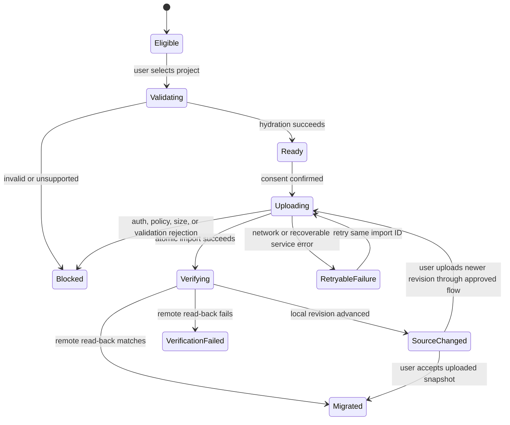

# Migrate browser-local projects to authenticated backend storage

## Status and intended outcome

This guide defines how a future authenticated Canvas Studio backend should import projects that were created in the browser-local phase. It is a design-time migration guide, not an executable runbook, and it does not authorize backend implementation or transfer any user data.

The required outcome is:

```text
Browser-local project remains safe
  -> user signs in and explicitly selects projects
  -> each selected snapshot is migrated and validated
  -> backend creates an authorized remote project atomically
  -> client reloads and verifies the remote project
  -> dashboard records the local-to-remote mapping
  -> local source remains available for recovery
```

Migration must never be automatic merely because authentication or a backend becomes available. The user chooses which local projects to upload and can continue using local-only projects during the supported coexistence period.

This storage migration is distinct from document-schema migration. Every selected source still passes the existing document and component migration pipeline before upload and again at the backend boundary.

## Scope, compatibility, and deadline

### Source

- Projects stored by the approved browser-local `ProjectRepository` adapter in IndexedDB.
- A preserved raw `ProjectDocument` plus local repository metadata such as `lastOpenedAt` and local revision.
- Document schema versions supported by the application at migration time. The verified baseline supports version 1 through the deterministic version 1 to 2 to 3 migration chain, migrates version 2 to 3, and accepts current version 3.

### Target

- An authenticated, authorized backend project record conforming to the [project persistence and backend specification](project-persistence-and-backend-spec.md).
- A server-owned project ID, owner relationship, revision, `createdAt`, and `updatedAt`.
- Validated editable content: `schemaVersion`, `name`, `pages`, `pageOrder`, and `homePageId`.

### Compatibility and coexistence

- Local-only and backend projects coexist during rollout.
- The dashboard identifies each project's storage location without implying that a local project is cloud-backed.
- A successfully imported remote project becomes the normal cloud entry only after remote read-back verification passes.
- The original local record is retained until an explicit user action and approved retention/recovery policy allow removal.
- Unsupported or corrupt records remain visible under the [corrupt and unsupported project dashboard contract](project-persistence-and-backend-spec.md#corrupt-and-unsupported-project-dashboard-contract) and are not uploaded through the normal migration path.

### Deadline

No migration deadline or local-storage retirement date is approved. A deadline requires product-owner approval, user communication, recovery support, and an approved retention policy. Until then, migration remains opt-in and the local adapter remains supported for existing local projects.

## Risks and authority

| Risk | Required control | Authority when implemented |
| --- | --- | --- |
| Silent disclosure of local projects | Explicit project selection and authenticated consent before any content leaves the browser | Approved product flow and authorization policy |
| Cross-user project exposure | Owner-scoped import, lookup, and idempotency checks on every backend operation | Authentication and authorization implementation |
| Duplicate remote projects after retry | One durable idempotency key per selected local project and owner | Import endpoint schema and backend uniqueness constraint |
| Local and remote ID collision | Backend allocates a fresh remote project ID; local ID remains a client-side mapping key | Backend project-creation transaction |
| Partial or invalid remote data | Validate before one atomic project-plus-import-mapping transaction | Executable import validator and database transaction |
| Local edits during upload | Capture source revision, re-read after upload, and surface newer local changes | Local repository and migration coordinator |
| Unsupported or corrupt source | Preserve raw local data, reject normal import, and direct the user to recovery/export support | Existing hydration result and future recovery contract |
| False completion after a bad upload | Read back, hydrate, and compare remote editable content before marking migrated | API adapter, hydration boundary, and verification code |
| Premature local deletion | Never delete automatically; require a separate approved cleanup flow | Retention policy and explicit user action |
| Sensitive data in telemetry | Log identifiers, stages, durations, and stable errors only; never log complete project JSON | Observability policy and implementation |

Verified code, schemas, authorization policy, database constraints, transactions, and runtime behavior override this draft for implemented behavior. If the future executable contract conflicts with this guide, stop migration rollout and update or supersede the guide after technical review.

## Identity and concurrency proposal

The recommended first migration contract separates local identity from remote identity:

| Value | Treatment |
| --- | --- |
| Local `projectId` | Remains the key of the local source and local migration journal. It is not accepted as the remote project's identity. |
| Remote `projectId` | Allocated by the backend inside the import transaction. |
| Page and node IDs | Preserved after full validation because their uniqueness boundary is the project document; remap only if a future backend contract proves it necessary. |
| Local revision | Captured to detect edits during migration; it does not become the remote concurrency revision. |
| Remote revision | Starts at the backend-approved creation revision and is owned only by the backend. The proposed initial value is `0`, consistent with current project creation, but this remains an approval gate. |
| Local timestamps | Retained in the local source. They are not accepted as ordinary server-owned timestamps. |
| Remote timestamps | Generated by the backend during atomic import. Preserving original local creation time requires a separately approved metadata field. |
| Import ID | A random, non-content-bearing idempotency key created and persisted locally before upload, then stored uniquely per owner by the backend. |

This strategy avoids trusting a client-generated project ID as a server resource identity and makes retry behavior deterministic. The dashboard stores a local mapping from `localProjectId` to the returned `remoteProjectId` only after verification.

## Migration state model

Migration state is repository metadata and must not enter `ProjectDocument`, Undo or Redo history, generated output, or Preview snapshots.



Text equivalent: a user-selected eligible project is validated before upload. Invalid projects are blocked without mutation. A ready snapshot uploads with a durable import ID. Recoverable failures retry the same import rather than creating another project. A successful remote write is read back and compared. Completion is recorded only after verification; newer local edits or mismatched remote content require explicit resolution.

An illustrative local-only migration journal is:

```ts
// Illustrative only; an executable schema must own the final contract.
type LocalProjectMigration = {
  localProjectId: string;
  sourceRevision: number;
  importId: string;
  status:
    | "eligible"
    | "validating"
    | "ready"
    | "uploading"
    | "verifying"
    | "migrated"
    | "source-changed"
    | "retryable-failure"
    | "blocked"
    | "verification-failed";
  remoteProjectId: string | null;
  lastErrorCode: string | null;
  startedAt: string | null;
  verifiedAt: string | null;
};
```

Do not store access tokens, project content, raw error bodies, or secrets in this journal.

## Preconditions and inventory

Migration implementation and rollout remain blocked until every required gate is approved:

| Gate | Required state | Evidence |
| --- | --- | --- |
| Authentication | Users can establish and recover a secure account session. | Approved identity architecture and tested session behavior |
| Authorization | Every project import and read is scoped to one authenticated owner. | Cross-user denial tests and security review |
| Backend repository | Create, load, save, and list behavior passes the shared repository contract. | Contract and integration test results |
| Import contract | Bounded request/response schemas, stable errors, and owner-scoped idempotency are executable. | Versioned schema and API tests |
| Storage transaction | Project record and import mapping commit atomically. | Database integration tests and failure injection |
| Identity policy | Remote project, revision, and timestamp rules are approved. | Product and architecture decision |
| Compatibility | Client and server support the same current project and component migration chains. | Compatibility matrix and fixture tests |
| Limits | Maximum request bytes, project size, pages, nodes, depth, rate, and timeout are approved. | Load tests and threat review |
| Retention and recovery | Local-source retention, remote cleanup, account deletion, and support escalation are approved. | Product, privacy, and operations decision |
| Observability | Safe metrics and stable error codes exist without project payload logging. | Logging review and redaction tests |

Before presenting migration to a user, inventory local projects without uploading them. For every local record, collect only locally displayed metadata needed for the choice: project name, page count, schema version, local revision, last update, approximate byte size, and validation eligibility. Do not send inventory telemetry containing project names or content by default.

The inventory classifies each record as:

- **Eligible:** current or supported older schema, full hydration succeeds, and size is within approved limits.
- **Needs local save:** an editor has unsaved or saving changes; finish or explicitly cancel that save before snapshotting.
- **Unsupported:** future or unsupported historical document/component version.
- **Invalid:** JSON, schema, tree, component, style, or placement validation fails.
- **Already migrated:** a verified local-to-remote mapping exists.
- **Migration incomplete:** a journal entry exists and must resume with the same import ID.

## Migration steps

| Phase | Action | Evidence | Stop/rollback condition |
| --- | --- | --- | --- |
| MG-00 - Approve contract | Approve identity, idempotency, revision, timestamp, retention, limit, and support decisions. | Recorded decisions and reviewed executable schemas | Any required owner, security, privacy, or retention decision is missing. |
| MG-01 - Build compatibility path | Implement the authenticated backend repository, import endpoint, owner-scoped idempotency mapping, and shared migration fixtures. | Contract, authorization, transaction, and compatibility tests | Client/server validators or migration chains disagree. |
| MG-02 - Inventory locally | Detect local projects after sign-in and show an opt-in selection UI without uploading content. | UI tests prove no network content request occurs before confirmation | Inventory requires sending project content or a false cloud status appears. |
| MG-03 - Snapshot and validate | Flush pending local save, persist an import ID, capture source revision, clone raw input, and run `prepareProjectHydration`. | Local journal plus successful structured hydration result | Save cannot finish, hydration fails, version is unsupported, or project exceeds approved limits. |
| MG-04 - Upload atomically | Send editable content through the authenticated import endpoint with the durable import ID. Backend revalidates, allocates remote metadata, and commits project plus import mapping once. | Success response, request ID, import ID, and database transaction evidence | Authentication, authorization, idempotency, validation, capacity, or transaction check fails. Local source remains unchanged. |
| MG-05 - Read back and verify | Load the returned remote project through the API adapter, hydrate it, and compare editable content with the uploaded normalized snapshot. | Successful hydration and semantic equality excluding server-owned identity/revision/timestamps | Remote load fails, content differs, or ownership is not provable. Do not mark migrated or hide local data. |
| MG-06 - Reconcile local changes | Re-read the local project and compare its revision with the captured source revision. | Matching revision or explicit `source-changed` state | A newer local revision exists and no user choice has been made. Do not overwrite either copy. |
| MG-07 - Record coexistence | Store the verified local-to-remote mapping and show the remote project as cloud-backed while retaining the local recovery copy. | Dashboard and repository integration tests | Local journal write fails. Retry the same import ID; do not create another remote project. |
| MG-08 - Roll out gradually | Enable internal/canary users, then bounded cohorts, then broader opt-in access after gates pass. | Success, retry, duplicate-prevention, validation, and support metrics | Error, mismatch, duplicate, authorization, or support thresholds exceed approved limits. Disable new migration starts. |
| MG-09 - Consider retirement | After an approved window, evaluate whether local-only creation or retained local copies may be retired. | Owner approval, user notice, recovery/export readiness, and retention evidence | Any unmigrated user, unresolved recovery need, legal hold, or unsupported project remains. Keep local support. |

## Per-project procedure

### 1. Obtain explicit consent

After sign-in, show **Local projects found on this browser**. List eligible projects with unchecked selection controls. Explain that uploading creates account-backed copies, uses network transfer, and leaves the browser copy intact. Do not preselect every project when that could surprise the user.

### 2. Stabilize the local source

If the project is open and dirty, request **Save locally now** and wait for its revisioned local transaction. Capture the resulting local revision. If saving fails or the project remains dirty, stop that project's migration without blocking other selected projects.

### 3. Persist retry identity before network work

Generate a random `importId` and write the migration journal entry in IndexedDB before sending a request. All retries for that selected snapshot reuse the same import ID. A retry must query or call the idempotent endpoint rather than issuing an unrelated create request.

### 4. Preserve and validate

Read the raw local record without mutation. Keep it as the recovery source. Run `prepareProjectHydration` on a clone:

1. parse or clone the source;
2. run the complete document migration chain;
3. validate the current document envelope;
4. validate tree integrity;
5. migrate and validate every component;
6. validate placement;
7. build the runtime index only for verification.

If the result is migrated to a newer supported schema, upload the normalized working document but do not overwrite the raw local source merely to prepare the import.

### 5. Send a bounded import request

The recommended API is a dedicated command such as `POST /api/project-imports`, because import has different identity and idempotency semantics from ordinary blank-project creation. The final path is an executable-contract decision.

An illustrative request is:

```json
{
  "content": {
    "schemaVersion": 3,
    "name": "My Store",
    "pages": {
      "page_home": {
        "id": "page_home",
        "name": "Home",
        "slug": "/",
        "rootIds": [],
        "nodes": {}
      }
    },
    "pageOrder": ["page_home"],
    "homePageId": "page_home"
  }
}
```

This is an illustrative minimal content payload. Real requests use the complete validated editable content. Send the durable import ID in the approved idempotency field or header. Never send local access tokens, editor session state, history, visitor form values, Preview snapshots, or repository-owned remote metadata.

The backend must:

1. authenticate the request;
2. resolve the owner before project lookup or creation;
3. enforce bounded body, rate, and project limits;
4. return the previously created result when the same owner and import ID already succeeded;
5. reconstruct a complete server-owned candidate;
6. run the approved migration and validation pipeline;
7. allocate remote identity, revision, and timestamps;
8. atomically persist the project and owner-scoped import mapping;
9. return the complete remote `ProjectDocument` plus a safe request ID.

### 6. Verify the remote copy

Do not trust the upload response alone. Load the remote project through the normal authenticated API adapter and run `prepareProjectHydration`. Compare normalized editable content with the uploaded normalized snapshot:

- `schemaVersion`
- `name`
- `pages`
- `pageOrder`
- `homePageId`

Exclude remote `projectId`, revision, and timestamps from semantic equality because the backend owns them. If page or node IDs were preserved by the approved contract, they must match inside the editable content.

### 7. Detect concurrent local edits

Re-read the local record after remote verification. If its revision still equals `sourceRevision`, record `migrated`. If it advanced, record `source-changed` and show both choices:

- keep using the verified remote snapshot and retain the newer local copy for recovery; or
- apply the newer local content through an approved revision-checked update after showing what will be replaced.

Never silently overwrite the verified remote project or discard the newer local changes. Automatic three-way merge and collaboration remain out of scope.

### 8. Record and present coexistence

Write `localProjectId -> remoteProjectId` only after verification. The account-backed project becomes the primary dashboard entry, marked **Saved to your account**. Keep a recoverable local entry or recovery view marked **Local copy on this browser**. Avoid showing two indistinguishable cards that could lead the user to edit the wrong copy.

## Validation

### Automated coverage

- Supported version 1 input migrates through version 2 to current version 3 before upload.
- Supported version 2 input migrates to current version 3 before upload.
- Current version 3 input remains semantically unchanged.
- Future, missing, ambiguous, corrupt, invalid-tree, unknown-component, invalid-prop/style, and invalid-placement inputs are blocked and preserved.
- Authentication is required and cross-user import IDs or project IDs fail closed.
- Reusing one import ID returns one remote project after timeouts and retries.
- Different import IDs may create distinct projects only after separate user intent.
- Failure before transaction commit creates neither a project nor an import mapping.
- Failure after a successful commit returns the same project on retry.
- Local revision changes during upload produce `source-changed` without overwriting either copy.
- Remote read-back mismatch produces `verification-failed` and never marks the local record migrated.
- Failure to write the local mapping retries with the same import ID and does not duplicate remotely.
- Project names and complete content never appear in default logs or analytics.
- Size, node, depth, page, string, request, rate, and timeout limits fail with stable bounded errors.

### Manual user journeys

1. Sign in with two local projects, select one, and confirm only that project is uploaded.
2. Cancel before confirmation and verify that no project-content request occurs.
3. Lose network connectivity during upload, reconnect, and resume without a duplicate.
4. Edit the same local project in another tab during upload and verify the explicit newer-local-change state.
5. Reload the dashboard after migration and confirm the cloud project opens through the API adapter while the local recovery copy remains identifiable.
6. Sign in as another user and verify no imported project, mapping, or existence signal is exposed.
7. Attempt migration with unsupported and corrupt fixtures and verify the source remains available for recovery.

### Reconciliation evidence

For each completed import, retain only the minimum safe operational record required by policy: owner-scoped import ID, remote project ID, final status, source schema version, source revision number, normalized byte count, timestamps, request IDs, and stable error codes. Do not retain project content in ordinary migration logs.

## Rollback and containment

The local source is the rollback anchor until remote verification succeeds. Migration changes authority only after a verified mapping exists.

- **Before remote commit:** abort the attempt and leave local data and local dashboard behavior unchanged.
- **During remote transaction:** abort atomically; neither the project nor import mapping may partially exist.
- **After remote commit but before response:** retry with the same import ID and recover the existing remote result.
- **After response but before read-back verification:** keep the remote record in a verification-pending state and keep the local project primary.
- **After verification but before local mapping write:** retry the mapping step with the same import ID; never create a new remote project.
- **After verified migration:** retain the local source. If rollout is disabled, stop new imports while existing verified remote projects remain accessible through the backend.
- **On authorization or data-integrity defect:** immediately stop new migration starts, contain affected remote records, preserve evidence under approved access controls, and follow the security/incident process. Do not automatically delete records.

There is no automatic rollback that overwrites a remote project with local content or deletes the remote record. Those actions require separate revision, retention, ownership, and user-intent checks.

## Communication and support

The user-facing flow must communicate:

- **Local projects found on this browser** before selection.
- **Upload selected projects to your account** at consent.
- **Your browser copies will remain available** before migration.
- Per-project validating, uploading, verifying, completed, needs attention, and failed states.
- A clear explanation when a source is unsupported, invalid, too large, or changed during upload.
- A retry action that reuses the same import rather than creating another project.
- The difference between **Saved locally on this browser** and **Saved to your account**.

Support diagnostics should expose a safe request ID, project-local display name only in the user's UI, stable error code, and next action. Support documentation must not ask users to paste raw project JSON containing sensitive authored content into ordinary tickets.

No forced-migration countdown, local-retirement date, or deletion warning should appear until those policies are approved and operational support is ready.

## Open approval decisions

| Decision | Recommended starting position | Status |
| --- | --- | --- |
| Remote project identity | Backend allocates a new remote ID and maps it locally. | Proposed |
| Page and node identity | Preserve validated IDs inside the imported project. | Proposed |
| Remote initial revision | Start at backend creation revision `0`. | Proposed |
| Remote timestamps | Generate on the backend; do not trust local values as server-owned fields. | Proposed |
| Idempotency | Unique import ID scoped to the authenticated owner. | Proposed |
| Local retention after success | Retain automatically; removal requires later explicit action and policy. | Proposed, duration intentionally unset |
| Invalid-project recovery | Block normal migration and provide a separately approved export/recovery flow. | Required before any forced migration |
| Newer local edits during upload | Stop automatic reconciliation and require user choice. | Proposed |
| Offline behavior | Migration requires connectivity; local editing remains available where supported. | Proposed |
| Import endpoint and versioning | Dedicated versioned import command rather than ordinary create. | Proposed |

## Completion and retirement

A single project migration is complete only when:

1. the user explicitly selected it;
2. the source was preserved and fully validated;
3. the backend created one owner-authorized project through an idempotent atomic transaction;
4. the client read back and hydrated the remote project;
5. normalized editable content matched;
6. concurrent local changes were absent or explicitly resolved;
7. the verified local-to-remote mapping was stored;
8. the dashboard presents storage location honestly; and
9. the local recovery source remains available under the approved policy.

The migration program may be considered complete only after all eligible users have had an approved opportunity to migrate, unsupported records have a recovery path, reconciliation and support queues are resolved, success and integrity thresholds pass, and the project owner approves any local-storage retirement.

Retiring local-only support or deleting retained local copies is a separate migration and destructive-data decision. It requires new user communication, dependency and retention checks, recovery/export readiness, technical verification, and explicit human approval.
