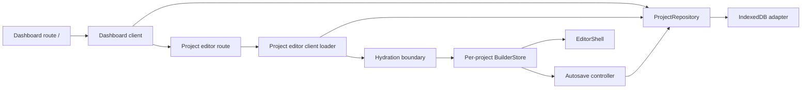

# Plan: Local project dashboard and persistent editor

## Goal, scope, and authority

Deliver this user flow without introducing a backend prematurely:

```text
Open Canvas Studio
  -> view locally stored website projects
  -> create or open a project
  -> enter that project's visual editor
  -> edit and save automatically
  -> return later and reopen the same project
```

The [project persistence and backend specification](project-persistence-and-backend-spec.md) owns the proposed product and storage contract. This plan orders the first browser-local implementation slice. The canonical `ProjectDocument`, migration code, hydration validator, commands, tests, and verified runtime behavior remain authoritative for current behavior.

**Implementation outcome:** PD-00 through PD-08 are complete in the current working tree. The local-first product slice is production-build verified; future backend migration remains outside this implementation.

### Included in the first release

- Make `/` the project dashboard.
- Add `/projects/[projectId]` as the project-specific editor route.
- Store multiple projects in browser IndexedDB behind a `ProjectRepository` interface.
- Create blank projects, list them, open them, rename them, and duplicate them.
- Preserve project separation so one project's store, history, or autosave cannot mutate another project.
- Add revision-checked saves, debounced autosave, a manual save action, and truthful local-only status.
- Reuse the existing schema migrations and atomic hydration validation on every load.
- Keep corrupt and unsupported records visible as bounded **Needs recovery** cards without exposing or mutating their raw data.
- Preserve the existing Preview flow as a separate one-use transport.
- Add behavior-first unit, repository-contract, component, route-integration, and failure-path coverage.

### Excluded from the first release

- User accounts, authentication, authorization, sharing, teams, or cloud synchronization.
- Backend API routes, a remote database, hosting selection, or local-to-cloud migration.
- Project deletion until recoverability and retention are approved.
- Import/export, thumbnails, publishing, deployments, assets, visitor form storage, and collaboration.
- An e-commerce template or template gallery. A user can create a blank project named for an e-commerce site and build it with existing components; starter templates require a separate approved slice.

## Verified baseline

| Baseline fact | Evidence | Planning effect |
| --- | --- | --- |
| `/` renders the editor directly. | [`src/app/page.tsx`](../../../src/app/page.tsx) | Replace this route with the dashboard and move editor composition to the dynamic project route. |
| The editor defaulted to one deterministic singleton project before this slice. | Historical baseline at commit `da11e47`; [`src/builder/ui/editor-shell.tsx`](../../../src/builder/ui/editor-shell.tsx) now requires an injected store. | The production singleton was removed and each loaded project now owns one store. |
| `ProjectDocument` owns project identity, content, timestamps, revision, and schema version 3. | [`src/builder/model/project-document.ts`](../../../src/builder/model/project-document.ts) | Do not invent a second project document format; remap schema-version-3 node references when duplicating a whole project. |
| Project hydration already migrates and validates untrusted input before atomic store replacement. | [`src/builder/project/hydration.ts`](../../../src/builder/project/hydration.ts) | All IndexedDB reads must pass this boundary before editing or autosave is enabled. |
| The builder store already tracks valid document state, history, `commitId`, and `dirty`. | [`src/builder/store/builder-store.ts`](../../../src/builder/store/builder-store.ts) | Extend persistence lifecycle state without putting it in Undo or Redo history. |
| The toolbar currently distinguishes dirty state but says clean work is only local. | [`src/builder/ui/editor-toolbar.tsx`](../../../src/builder/ui/editor-toolbar.tsx) | Replace the binary indicator with explicit loading, unsaved, saving, saved locally, conflict, and error states. |
| Preview uses bounded one-use `localStorage` snapshots and is not durable project persistence. | [`src/builder/preview/preview-snapshot.ts`](../../../src/builder/preview/preview-snapshot.ts) | Do not reuse Preview storage for the project repository. |
| Installed Next.js 16.3 passes dynamic `params` as a promise, while IndexedDB and event handlers require a Client Component boundary. | Installed `dynamic-routes.md` and `server-and-client-components.md` under `node_modules/next/dist/docs/01-app/` | Keep route pages as small Server Components and isolate repository access in client entry components. |

## Proposed architecture



Text equivalent: the dashboard and project editor use the same repository contract. The IndexedDB adapter is the first implementation. The editor loader retrieves one project, validates it through the normal hydration boundary, creates a dedicated builder store, and renders `EditorShell`. An autosave controller observes committed store changes and saves through the repository without entering command history.

### Boundary rules

1. `ProjectRepository` owns storage operations and storage-shaped errors; UI components never call IndexedDB directly.
2. The IndexedDB adapter is loaded only in a Client Component module graph.
3. Repository reads return a project only after migration and hydration validation succeeds. Rejected source remains untouched in IndexedDB.
4. A route `projectId` selects a record; it never authorizes access or causes a missing record to be replaced with a new project.
5. Each editor route owns exactly one `BuilderStore`. The global deterministic `editorStore` is removed from the production path.
6. Saves compare `expectedRevision` and update the document, revision, and timestamp atomically in one IndexedDB read-write transaction.
7. Save lifecycle updates do not create history, increment `commitId`, change selection, or modify authored content.
8. Preview continues to serialize the active validated project snapshot through its existing bounded transport.

## Constraints and assumptions

| Item | Classification | Required validation or decision |
| --- | --- | --- |
| The first release is browser-local and single-user. | Confirmed scope | UI must always say that projects are saved on this browser, not backed up to an account. |
| New projects start with the existing blank Home page. | Confirmed implementation scope | Starter templates remain a separate approved slice. |
| Rename and duplicate are included; deletion is not. | Confirmed safety boundary | Do not render a destructive project action until recovery and retention are approved. |
| IndexedDB is implemented with the browser API, not a runtime persistence library. | Implemented technical choice | Keep the raw API behind `ProjectRepository` and covered by adapter tests. |
| `fake-indexeddb` is a development dependency. | Implemented dependency | It is test-only; production uses the browser API directly. |
| Autosave debounce starts at 750 ms after the latest committed change. | Implemented UX value | Revise only from measured behavior and preserve deterministic controller coverage. |
| A stale revision is a visible conflict, not an automatic overwrite or merge. | Confirmed integrity rule | Multi-tab tests must prove the older editor cannot overwrite the newer stored revision. |
| The last unsaved edit can exist during the debounce interval. | Verified risk | Provide **Save now**, save-before-dashboard navigation, and a dirty-page unload warning. Do not claim a close-time async save is guaranteed. |

## Dependencies

| Dependency | Required state | Owner | Failure response |
| --- | --- | --- | --- |
| Local-first slice and blank-project assumption | Approved and implemented | Project owner | Reopen product scope only through an explicit follow-up request. |
| Canonical project schema and hydration boundary | Existing schema version 3 tests remain green | Project owner | Stop if persistence requires bypassing or duplicating validation. |
| Multi-page commands and editor behavior | Verified in the active branch baseline | Project owner | Rebase or revise the plan if the implementation changes before this work starts. |
| IndexedDB test environment | Deterministic contract tests can run under Vitest | Project owner | Use an approved test-only adapter; do not ship untested transaction semantics. |
| Next.js 16.3 route conventions | Dynamic route page awaits `params`; browser APIs remain client-only | Project owner | Re-read installed docs if the Next.js version changes. |
| Browser storage availability | Failure state is testable and visible | Project owner | Block create/open/save and preserve in-memory edits; never show a false saved state. |

## Ordered work

| ID | Deliverable/action | Depends on | Verification | Owner | Status |
| --- | --- | --- | --- | --- | --- |
| PD-00 | Approve the bounded local-first scope and provisional assumptions. | None | Recorded owner decision in `workspace.md` | Project owner | Complete |
| PD-01 | Define repository types, stable error codes, summaries, save receipts, and reusable contract tests. | PD-00 | Typecheck plus contract tests against the in-memory test adapter | Project owner | Complete |
| PD-02 | Implement the IndexedDB adapter with validated reads, isolated unavailable-record summaries, and atomic revision checks. | PD-01 | Contract tests against IndexedDB, including mixed inventories, storage unavailability, and stale revisions | Project owner | Complete |
| PD-03 | Implement safe whole-project duplication with fresh project, page, and node IDs. | PD-01 | Unit tests prove references remain valid and no source IDs survive | Project owner | Complete |
| PD-04 | Replace `/` with the accessible local project dashboard, including the approved **Needs recovery** state. | PD-02, PD-03 | Dashboard tests cover ready/unavailable inventories, safe details, prohibited actions, keyboard behavior, and responsive layout | Project owner | Complete |
| PD-05 | Add `/projects/[projectId]` and a per-project editor loader/store. | PD-02 | Route integration tests cover load, missing, corrupt, and storage-unavailable states | Project owner | Complete |
| PD-06 | Add revision-safe autosave, manual save, navigation protection, and truthful status UI. | PD-05 | Store/controller tests cover newer edits, failures, retries, conflicts, and unload state | Project owner | Complete |
| PD-07 | Run end-to-end behavior checks across multiple projects and Preview. | PD-04, PD-06 | Acceptance scenarios and verification matrix | Project owner | Complete |
| PD-08 | Update maintained execution context with verified as-built behavior. | PD-07 | Documentation, links, diff, and whitespace checks | Project owner | Complete |

## Implementation detail by slice

### PD-01 - Repository contract and test seam

Create a persistence area outside `src/app` so route files stay thin:

- `src/builder/persistence/project-repository.ts`
- `src/builder/persistence/project-repository-errors.ts` if error definitions are large enough to justify separation
- `src/builder/testing/memory-project-repository.ts`
- `src/builder/persistence/__tests__/project-repository-contract.ts`
- `src/builder/persistence/__tests__/memory-project-repository.spec.ts`

The contract implements the approved `list`, `create`, `load`, `save`, `rename`, and `duplicate` operations from the specification. Do not implement `delete` in this slice. Use stable discriminated errors such as `not-found`, `invalid-project`, `unsupported-version`, `revision-conflict`, `storage-unavailable`, and `unexpected-storage-error`; UI code must not parse browser exception messages.

Implement the specification's [corrupt and unsupported project dashboard contract](project-persistence-and-backend-spec.md#corrupt-and-unsupported-project-dashboard-contract) as the single product authority. `list` returns a ready/unavailable union, validates each physical record independently, preserves raw failures, exposes only bounded recovery metadata, and continues listing valid projects. Ready summaries sort by `updatedAt`; unavailable summaries follow the specified safe-date and recovery-ID ordering. `pageCount` is derived only from successfully hydrated document content.

### PD-02 - IndexedDB repository

Add `src/builder/persistence/indexeddb-project-repository.ts` and focused tests. Use one versioned Canvas Studio database and one project object store keyed by `projectId`. Keep the database name, version, store name, and open/upgrade logic in one module.

Each operation must:

1. Convert IndexedDB request and transaction callbacks to bounded promises.
2. Reject blocked, aborted, denied, or unavailable storage with a stable repository error.
3. Preserve a raw record when validation or migration fails.
4. Use `prepareProjectHydration` before returning editable data.
5. Perform revision comparison and write in one read-write transaction.
6. Increment revision and set `updatedAt` only on a successful write.
7. Avoid logging complete project documents.

Run the shared contract suite against the IndexedDB adapter. If a test-only IndexedDB implementation is added, update only `devDependencies` and the lockfile after compatibility review.

### PD-03 - Project duplication

Add `src/builder/project/duplicate.ts`. Duplication creates a new project identity and remaps every page ID, node ID, `pageOrder` entry, `homePageId`, page `rootIds`, and node `childIds`. It resets timestamps and revision through repository-owned creation behavior. It never mutates the source project.

Tests cover multiple pages, nested nodes, a home page, source/duplicate independence, deterministic injected IDs, and hydration of the completed duplicate.

### PD-04 - Dashboard route and UI

Change [`src/app/page.tsx`](../../../src/app/page.tsx) to render a small Server Component shell around a client dashboard, proposed at `src/builder/dashboard/project-dashboard.tsx`. Keep repository creation lazy and client-only.

The dashboard includes:

- Canvas Studio identity and a clear **New project** action;
- empty, loading, ready, and storage-unavailable states;
- mixed ready and **Needs recovery** inventories, including a separate unavailable count;
- a project-name dialog with validation and focus restoration;
- project cards showing name, page count, last saved time, and **Saved on this browser**;
- unavailable cards with safe names, reason-specific copy, **Stored on this browser**, and an accessible **View recovery details** dialog;
- open, rename, and duplicate actions with pending/error feedback;
- no delete action in this release;
- responsive, keyboard-operable, reduced-motion-safe styling scoped in [`src/app/globals.css`](../../../src/app/globals.css).

After creation or duplication succeeds, navigate to `/projects/{projectId}`. A failed mutation remains on the dashboard and announces the error without inserting a false card.

### PD-05 - Project editor route and loading boundary

Add:

- `src/app/projects/[projectId]/page.tsx`
- `src/builder/persistence/project-editor-loader.tsx` or an equivalently scoped client entry

The page awaits the Next.js 16 `params` promise and passes the opaque string to the client loader. The loader opens the repository, loads and validates the record, creates one `BuilderStore`, then renders `EditorShell` with that required store.

[`src/builder/ui/editor-shell.tsx`](../../../src/builder/ui/editor-shell.tsx) now requires an explicit store, the former `src/builder/store/editor-store.ts` singleton is retired, and editor tests construct deterministic stores directly.

Render bounded states for loading, missing project, unsupported/corrupt project, and unavailable storage. When a route resolves to an unavailable record, reuse the specification's safe reason copy and preservation statement. A failed load must not hydrate a blank replacement, expose raw validation details, enable autosave, or render ordinary project actions.

### PD-06 - Persistence lifecycle and autosave

Extend `BuilderStoreState` with persistence lifecycle data and actions that cannot enter document history. The minimum states are `loading`, `saved`, `dirty`, `saving`, `error`, and `conflict`.

Implement a client autosave controller with an injectable repository, timer, and clock:

1. Observe committed `commitId` and `dirty` state.
2. Debounce from the latest applied command, Undo, or Redo.
3. Capture the document, `commitId`, and expected revision at save start.
4. Save through `ProjectRepository`.
5. Apply repository-owned revision and `updatedAt` without changing authored content or history.
6. Mark clean only when the current `commitId` still matches the captured value.
7. Schedule another save when newer edits exist.
8. Stop automatic writes on revision conflict until the user reloads or returns to the dashboard.
9. Preserve in-memory edits and expose retry after a recoverable storage failure.

Update the toolbar to include a dashboard link, **Save now**, and an accessible live status. Dashboard navigation must await a dirty save and remain in the editor if it fails. Register a `beforeunload` warning only while work is dirty, saving, failed, or conflicted; do not promise that asynchronous IndexedDB work completes during unload.

### PD-07 - Acceptance and regression verification

Verify these scenarios:

1. An empty profile shows an understandable empty dashboard.
2. Creating `My Store` opens a unique project with one blank Home page.
3. An edit becomes **Saving**, then **Saved on this browser**, and survives reload.
4. A second project has independent content, history, active page, and save state.
5. Rename updates the dashboard through a revisioned write.
6. Duplicate produces a valid independent project with fresh project, page, and node IDs.
7. Two open tabs cannot silently overwrite a newer revision.
8. Every corrupt hydration stage becomes an isolated **Needs recovery** card; every explicit compatibility failure becomes the unsupported copy; valid sibling projects still list.
9. An unavailable card exposes only a safe name/date/reason, omits page count and ordinary actions, and opens an accessible recovery-details dialog without raw validation data.
10. Direct navigation to an unavailable record never creates a blank replacement, hydrates partial data, starts autosave, or mutates the raw source.
11. IndexedDB denial or failure never produces a false saved state and is not mislabeled as a corrupt project.
12. Preview still opens the active unsaved snapshot without becoming durable storage.
13. Dashboard dialogs, project actions, error messages, recovery status, and save status work by keyboard and are announced to assistive technology.

## Quality and approval gates

Before implementation approval:

- Confirm the blank-project and test-dependency assumptions.
- Confirm that deletion and starter templates remain separate.

Before each implementation slice is considered complete:

- Run its focused Vitest suites.
- Run `pnpm typecheck` and scoped ESLint.
- Run `git diff --check` and review only task-related files.
- Update the branch journal with the exact verification and resume point.

Before branch completion:

- Run `pnpm lint`.
- Run `pnpm typecheck`.
- Run the complete `pnpm test` suite under the declared Node 24 runtime.
- Run `pnpm build` with Next.js 16.3.
- Perform manual browser checks for reload persistence, multiple projects, mixed ready/recovery inventories, direct navigation to an unavailable record, two-tab conflicts, unavailable storage, responsive dashboard layout, keyboard navigation, focus restoration, and Preview regression.
- Publish a D5 implementation report with exact command results and known limitations.
- Obtain technical review for the persistence transaction, validation, conflict, and data-loss boundaries.

## Risks, rollback, and containment

| Risk | Containment | Rollback or safe resume point |
| --- | --- | --- |
| Browser storage is unavailable, cleared, or private-mode-limited. | Explicit local-only warning, stable error UI, no false saved status, future export slice. | Dashboard and loader remain usable as failure states; do not fall back silently to volatile storage. |
| A malformed stored project crashes listing, disappears, or leaks authored data through diagnostics. | Apply the canonical ready/unavailable union per record, preserve raw source, expose bounded recovery metadata only, and never autosave rejected data. | Keep the **Needs recovery** card visible, disable ordinary actions, and leave IndexedDB unchanged. |
| Autosave clears dirty state while newer edits exist. | Capture `commitId`; clean only on exact match; add deterministic race tests. | Disable autosave controller while preserving in-memory editing and manual recovery. |
| Two tabs overwrite one another. | Atomic expected-revision transaction and visible conflict state. | Stop writes from the stale tab; reload is explicit and never automatic. |
| Duplicated internal IDs still reference the source project. | Complete ID maps followed by full hydration and reference tests. | Reject the duplicate transaction and preserve the source. |
| Moving `/` breaks editor assumptions or tests. | Introduce the dynamic route before removing the root editor entry; use explicit store injection. | Restore the old route composition without reverting repository work. |
| IndexedDB tests pass against a mock but not a browser. | Shared contract suite plus manual real-browser verification. | Keep the adapter behind the repository boundary and block release. |
| The dashboard expands into auth, templates, publishing, or deletion. | Enforce this plan's exclusions and create separately approved workspaces/slices. | Stop at the last verified PD milestone and update the journal. |

## Completion

This plan is ready for implementation only after PD-00 is approved. The feature is complete when PD-01 through PD-08 are implemented, every quality gate passes, the dashboard-to-editor-to-reload journey is verified in a real browser, failure states remain honest and recoverable, and durable as-built knowledge is promoted to its canonical maintained documentation.

The branch must not be presented as providing accounts, cloud backup, publishing, deletion, starter templates, or multi-device synchronization.
